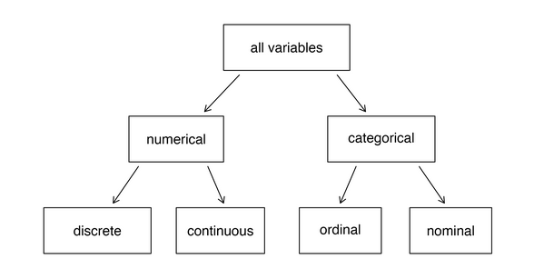
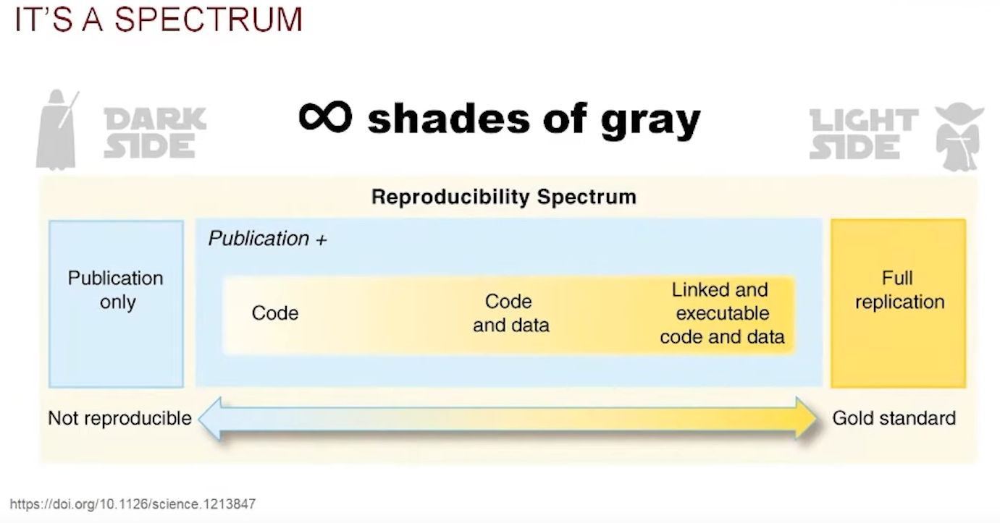

# Introducción a la ciencia de datos

## Trabajo previo

### Lecturas

Çetinkaya-Rundel, M. y Hardin, J. (2024). Chapter 1: Hello data. En *Introduction to modern statistics* (2.ª ed.). OpenIntro. https://openintrostat.github.io/ims/data-hello.html
\
\
Wickham, H., Çetinkaya-Rundel, M. y Grolemund, G. (2023). Introduction. En *R for data science: Import, tidy, transform, visualize, and model data* (2.ª ed.). O'Reilly Media. https://r4ds.hadley.nz/intro

## Introducción

Los científicos tratan de responder preguntas mediante métodos rigurosos y observaciones cuidadosas. Estas observaciones, recopiladas de notas de campo, encuestas y experimentos, entre otras fuentes, forman la columna vertebral de una investigación y se denominan datos (Çetinkaya-Rundel y Hardin, 2024).

Este capítulo introduce los conceptos fundamentales sobre los datos —observaciones, variables y sus tipos— y presenta la ciencia de datos como la disciplina que permite convertirlos en conocimiento. Además, aborda dos ideas que acompañarán todo el curso: la reproducibilidad de los análisis y las herramientas informáticas que la hacen posible.

## Datos

En términos generales, los **datos** son representaciones simbólicas (numéricas, alfabéticas, visuales o de cualquier otro tipo) susceptibles de ser comunicadas, interpretadas y procesadas para generar información o conocimiento. La norma internacional ISO/IEC 2382 (Information technology - Vocabulary) describe los datos como *hechos relacionados con un objeto o evento, que pueden registrarse o transmitirse con fines de procesamiento* (ISO/IEC 2382, 2015). Por su parte, Beyer y Laney (2012) señalan que los datos son la *materia prima de la información y, en su conjunto, pueden constituir activos de gran valor para organizaciones y sistemas de conocimiento*. Los datos, por sí mismos, no siempre constituyen información, sino que adquieren sentido al ser analizados, contextualizados y combinados.

Por ejemplo, la tabla 1 muestra un conjunto de datos conformado por registros de presencia de especies de fauna silvestre en Costa Rica, obtenidos de [GBIF](https://www.gbif.org/) (Infraestructura Mundial de Información en Biodiversidad). La columna `gbifID` contiene el identificador único que GBIF le asigna a cada registro y enlaza a su página original. Los nombres de las variables corresponden a términos del estándar [Darwin Core](https://dwc.tdwg.org/), tal como los entrega GBIF (`gbifID` e `iucnRedListCategory` son campos agregados por GBIF, no términos del estándar). La altitud (`elevation`) se expresa en metros.

<figure style="text-align: center; margin: 20px 0;">
    <figcaption><strong>Tabla 1</strong>. Registros de presencia de especies de fauna silvestre en Costa Rica. Fuente: <a href="https://www.gbif.org/">GBIF</a> (consulta: 8 de agosto de 2026).</figcaption>
    <table class="table table-bordered table-striped" style="margin: 0 auto;">
        <thead>
            <tr>
                <th>gbifID</th>
                <th>species</th>
                <th>decimalLongitude</th>
                <th>decimalLatitude</th>
                <th>elevation</th>
                <th>eventDate</th>
                <th>individualCount</th>
                <th>iucnRedListCategory</th>
                <th>basisOfRecord</th>
            </tr>
        </thead>
        <tbody>
        <tr>
            <td><a href="https://www.gbif.org/occurrence/5083205506">5083205506</a></td>
            <td><em>Panthera onca</em></td>
            <td class="align-right">-85.414700</td>
            <td class="align-right">10.819316</td>
            <td class="align-right"></td>
            <td>2024-01-26</td>
            <td class="align-right">3</td>
            <td>NT</td>
            <td>MACHINE_OBSERVATION</td>
        </tr>
        <tr>
            <td><a href="https://www.gbif.org/occurrence/5891408331">5891408331</a></td>
            <td><em>Puma concolor</em></td>
            <td class="align-right">-85.058334</td>
            <td class="align-right">9.873334</td>
            <td class="align-right">362</td>
            <td>2018-04-10</td>
            <td class="align-right">1</td>
            <td>LC</td>
            <td>MATERIAL_CITATION</td>
        </tr>
        <tr>
            <td><a href="https://www.gbif.org/occurrence/4174649301">4174649301</a></td>
            <td><em>Tapirella bairdii</em></td>
            <td class="align-right">-83.500000</td>
            <td class="align-right">9.500000</td>
            <td class="align-right">3654</td>
            <td>1967-02-04</td>
            <td class="align-right">1</td>
            <td></td>
            <td>PRESERVED_SPECIMEN</td>
        </tr>
        <tr>
            <td><a href="https://www.gbif.org/occurrence/4174649340">4174649340</a></td>
            <td><em>Ateles geoffroyi</em></td>
            <td class="align-right">-84.893100</td>
            <td class="align-right">10.437500</td>
            <td class="align-right">905</td>
            <td>1969-11-07</td>
            <td class="align-right">1</td>
            <td>EN</td>
            <td>PRESERVED_SPECIMEN</td>
        </tr>
        <tr>
            <td><a href="https://www.gbif.org/occurrence/6150492462">6150492462</a></td>
            <td><em>Crocodylus acutus</em></td>
            <td class="align-right">-84.617872</td>
            <td class="align-right">9.757316</td>
            <td class="align-right"></td>
            <td>2026-01-13</td>
            <td class="align-right">1</td>
            <td>VU</td>
            <td>HUMAN_OBSERVATION</td>
        </tr>
        <tr>
            <td><a href="https://www.gbif.org/occurrence/5131991086">5131991086</a></td>
            <td><em>Chelonia mydas</em></td>
            <td class="align-right">-83.873328</td>
            <td class="align-right">8.716209</td>
            <td class="align-right"></td>
            <td>2025-04-16</td>
            <td class="align-right">2</td>
            <td>LC</td>
            <td>HUMAN_OBSERVATION</td>
        </tr>
        <tr>
            <td><a href="https://www.gbif.org/occurrence/6150672236">6150672236</a></td>
            <td><em>Ara macao</em></td>
            <td class="align-right">-83.469447</td>
            <td class="align-right">8.873869</td>
            <td class="align-right"></td>
            <td>2026-01-29</td>
            <td class="align-right">8</td>
            <td>LC</td>
            <td>HUMAN_OBSERVATION</td>
        </tr>
        <tr>
            <td><a href="https://www.gbif.org/occurrence/896284939">896284939</a></td>
            <td><em>Ara macao</em></td>
            <td class="align-right">-85.317394</td>
            <td class="align-right">10.810174</td>
            <td class="align-right">853</td>
            <td>1930-10-25</td>
            <td class="align-right"></td>
            <td>LC</td>
            <td>PRESERVED_SPECIMEN</td>
        </tr>
    </tbody>
    </table>
</figure>

El conjunto de datos de la tabla 1 consta de ocho observaciones (filas) y nueve variables (columnas). Nótese que algunas celdas están vacías: es común que los datos reales contengan valores faltantes, algo que debe tenerse en cuenta al procesarlos.

### Observaciones y variables

La presentación y descripción efectivas de los datos constituyen el primer paso en un análisis (Çetinkaya-Rundel y Hardin, 2024). Una de las formas más comunes de representar datos es mediante tablas en las cuales cada fila es una **observación** y cada columna es una **variable**. Una observación corresponde a un elemento de datos que ha sido estudiado y cada variable a una característica de ese elemento. En la tabla 1, por ejemplo, cada observación corresponde a un registro de presencia de una especie, descrito por nueve variables.

### Tipos de variables

Las variables de los datos de la tabla 1 son de varios tipos, cuya jerarquía se muestra en la figura 1.

<figure style="text-align: center;">
  
  <figcaption><strong>Figura 1</strong>. Tipos de variables. Fuente: Çetinkaya-Rundel y Hardin (2024).</figcaption>
</figure>

#### Numéricas

Corresponden a números a los cuales se les pueden aplicar operaciones como suma, resta, multiplicación, división y otras similares. Las variables numéricas pueden ser discretas o continuas.

##### Discretas

Toman valores específicos que se pueden contar. La variable `individualCount` (cantidad de individuos observados en cada registro), en este caso, es discreta.

##### Continuas

Pueden tomar cualquier valor dentro de un intervalo o rango continuo. Estas variables se caracterizan por su capacidad para representar medidas precisas y pueden asumir un número infinito de valores, incluso dentro de un rango limitado (ej. entre 0 y 1). Las variables `decimalLongitude` (longitud), `decimalLatitude` (latitud) y `elevation` (altitud) son continuas. Nótese que la altitud aparece redondeada al metro en la tabla 1: esto refleja la precisión con que se midió, no la naturaleza de la variable, ya que entre dos altitudes cualesquiera siempre hay valores intermedios posibles. En cambio, una variable discreta como `individualCount` solo puede tomar ciertos valores, sin intermedios.

#### Categóricas

Las variables categóricas (también llamadas cualitativas), son aquellas que describen una característica o cualidad de una observación y pueden utilizarse para clasificar las observaciones en grupos o categorías. A diferencia de las variables numéricas, que expresan cantidades, las variables categóricas expresan atributos no numéricos. Las variables categóricas pueden ser nominales u ordinales.

##### Nominales

No existe un orden inherente o jerarquía entre las categorías. Las variables `species` (nombre científico) y `basisOfRecord` (tipo de registro) son nominales. También lo es `gbifID`: aunque sus valores son números, funcionan como etiquetas que identifican cada registro, por lo que no tiene sentido aplicarles operaciones aritméticas.

##### Ordinales

Hay un orden o jerarquía clara entre las categorías, como en el caso de la variable `iucnRedListCategory`, cuyos valores corresponden a las categorías de riesgo de extinción de la [Lista Roja](https://www.iucnredlist.org/es) de la Unión Internacional para la Conservación de la Naturaleza (UICN), las cuales siguen un orden creciente de riesgo (ej. LC: preocupación menor, NT: casi amenazada, VU: vulnerable, EN: en peligro).

## Ciencia de datos

Los datos, en su estado original, carecen de contexto e interpretación. La **ciencia de datos** es una disciplina que permite convertir datos sin procesar en comprensión y conocimiento. Combina estadística, matemáticas y programación de computadoras. A diferencia de otros enfoques de generación de conocimiento, la ciencia de datos intenta resolver problemas mediante el uso de grandes volúmenes de datos y de técnicas avanzadas de modelado, apoyándose fuertemente en la programación de computadoras y en el aprendizaje automático (*machine learning*). El surgimiento y la popularidad de la ciencia de datos están motivados por un incremento acelerado de la cantidad de datos existentes, así como por la disponibilidad de herramientas computacionales para procesarlos y analizarlos. Además, estos avances tecnológicos han sido apoyados por un cambio cultural propiciado por movimientos como el de ciencia abierta (*open science*), el cual promueve el acceso libre a la investigación científica, incluidas las publicaciones, los datos, las metodologías y el código fuente.

La figura 2 ilustra el ciclo de vida de un proyecto típico de ciencia de datos, el cual incluye los procesos de importar, ordenar, transformar, visualizar, modelar y comunicar. Todos se articulan mediante programación de computadoras.

<figure style="text-align: center;">
  
  <figcaption><strong>Figura 2</strong>. Procesos de ciencia de datos. Fuente: Wickham et al. (2023).</figcaption>
</figure>

**Importar** los datos generalmente implica leerlos de un archivo, una base de datos o una [interfaz de programación de aplicaciones (API)](https://es.wikipedia.org/wiki/API) y cargarlos en estructuras apropiadas para este propósito en un lenguaje de programación.

**Ordenar** o estructurar los datos significa colocarlos en estructuras rectangulares de filas y columnas, similares a tablas, de manera que cada fila sea una observación y cada columna una variable.

**Transformar** los datos incluye, entre otras operaciones, la generación de algún subconjunto de observaciones o variables del conjunto original, la creación de nuevas variables a partir de las ya existentes o el cálculo de estadísticas como conteos y promedios.

Una vez que los datos están bien estructurados y con las variables que se requieren para el análisis, se puede proceder a la generación de conocimiento mediante dos mecanismos: la visualización y la modelización. Ambos tienen fortalezas y debilidades y es común iterar varias veces entre uno y otro.

**Visualizar** los datos en tablas, gráficos, mapas u otros formatos permite encontrar patrones inesperados o formular nuevas preguntas. Una buena visualización también puede indicar si se están formulando preguntas equivocadas o utilizando datos que no son apropiados para el problema que se desea resolver. Es importante tener en cuenta que las visualizaciones deben ser interpretadas por seres humanos. Por este motivo, visualizaciones como gráficos estadísticos y mapas deben ser seleccionadas con cuidado y elaborarse detalladamente.

**Modelar** es crear una representación abstracta y estructurada de los datos, con el fin de facilitar su análisis y realizar predicciones. Al ser herramientas matemáticas o computacionales, los modelos muchas veces pueden mejorarse mediante el empleo de mayores capacidades de cómputo, lo que los hace menos dependientes de la intervención humana, como en el caso de las visualizaciones.

**Comunicar** es el último paso y es una actividad crítica de cualquier proyecto de análisis de datos o de ciencia en general. No importa lo bien que los modelos y visualizaciones ayuden a entender los datos si los resultados no pueden ser comunicados a otras personas.

Estos procesos se ilustran en un cuaderno de notas Jupyter con [ejemplos de procesamiento de datos de biodiversidad mediante ciencia de datos](https://colab.research.google.com/drive/1VMj1WfamqtJe6V9OAeDZ2BE2SdiEI6up?usp=sharing).

## Reproducibilidad

La **reproducibilidad** es la capacidad de un ensayo o experimento de ser reproducido por otros. Más formalmente, en investigación cuantitativa, un análisis se considera reproducible si *el código fuente y los datos utilizados por un investigador para llegar a un resultado están disponibles y son suficientes para que otro investigador, trabajando de manera independiente, pueda llegar al mismo resultado* (Gandrud, 2020).

El concepto de reproducibilidad es cada vez más importante debido, entre otras razones, al aumento exponencial de datos disponibles y a la aplicación de la programación de computadoras, para procesar estos datos, por parte de especialistas de muchas disciplinas. Sin embargo, en años recientes, se ha generado una creciente preocupación debido a que muchos estudios científicos publicados fallan las pruebas de reproducibilidad.

Singleton et al. (2016) han identificado los siguientes retos para la reproducibilidad en ciencia de datos geoespaciales:

1. Los datos deben ser de dominio público y estar disponibles para los investigadores.
2. El software utilizado debe ser de código abierto (*open source*) y estar disponible para ser revisado.
3. Siempre que sea posible, los [flujos de trabajo](https://es.wikipedia.org/wiki/Flujo_de_trabajo) deben ser públicos y con enlaces a los datos, software y métodos de análisis, junto con la documentación necesaria.
4. El proceso de [revisión por pares (*peer review process*)](https://es.wikipedia.org/wiki/Revisi%C3%B3n_por_pares) y la publicación académica deben requerir la presentación de un modelo de flujo de trabajo e idealmente la disponibilidad de los materiales necesarios para la replicación.
5. En los casos en los que la reproducibilidad total no sea posible (ej. datos sensibles), los investigadores deben esforzarse por incluir todos los aspectos que puedan de un marco de trabajo abierto.

En general, el estándar mínimo de reproducibilidad requiere que los datos y el código fuente estén disponibles para otros investigadores (Peng, 2011). Sin embargo, dependiendo de las circunstancias y recursos disponibles, existe todo un espectro de posibilidades, que se ilustra en la figura 3.

<figure style="text-align: center;">
  
  <figcaption><strong>Figura 3</strong>. Espectro de reproducibilidad. Fuente: <a href="https://www.youtube.com/watch?v=ZjXb53pOor0">Anita Graser</a> con base en Peng (2011).</figcaption>
</figure>

## Herramientas

La implementación de un proyecto de ciencia de datos requiere del uso de herramientas informáticas como lenguajes de programación, sintaxis y formatos para documentación y sistemas de control de versiones.

### Lenguajes de programación

Como se ha mencionado, la programación de computadoras es una actividad presente durante todos los procesos de ciencia de datos. Hay muchos lenguajes que pueden utilizarse en este campo. Entre los más populares, pueden mencionarse [Python](https://www.python.org/), [R](https://www.r-project.org/), [SQL](https://www.iso.org/standard/76583.html) y [JavaScript](https://ecma-international.org/publications-and-standards/standards/ecma-262/).

### Sintaxis y formatos para documentación

La documentación es vital durante todo el ciclo de vida de una investigación reproducible. Se recomienda utilizar mecanismos estandarizados y abiertos como el [lenguaje de marcado de hipertexto (HTML, en inglés, *HyperText Markup Language*)](https://es.wikipedia.org/wiki/HTML) o [Markdown](https://en.wikipedia.org/wiki/Markdown), con los cuales pueden crearse documentos mediante editores de texto simples (i.e. no se requiere de software propietario), y exportables a varios formatos (ej. [LaTeX](https://es.wikipedia.org/wiki/LaTeX), [PDF](https://es.wikipedia.org/wiki/PDF)).

### Sistemas de control de versiones

Para dar mantenimiento, tanto al código fuente como a la documentación, es necesario un sistema de [control de versiones](https://es.wikipedia.org/wiki/Control_de_versiones) como [Git](https://es.wikipedia.org/wiki/Git), el cual permite llevar el registro de los cambios en archivos y también facilita el trabajo colaborativo al reunir las modificaciones hechas por varias personas. Git es usado en varias plataformas que comparten código fuente (ej. [GitHub](https://github.com/), [GitLab](https://about.gitlab.com/)) y que ofrecen servicios relacionados, como hospedaje de sitios web.

## Ejercicios

1. En el portal de [GBIF](https://www.gbif.org/occurrence/search) busque registros de presencia de una especie de su interés (puede filtrar por país u otros criterios). Elija un registro y examine su página de detalle.
    - Identifique al menos cinco variables presentes en el registro y clasifique cada una según la jerarquía de la figura 1.
    - ¿Cuáles variables del registro tienen valores faltantes?
2. Un conjunto de datos de estaciones meteorológicas de Costa Rica contiene las siguientes variables: nombre de la estación, provincia, altitud, temperatura promedio anual, cantidad de días con lluvia al año y categoría climática (seca, intermedia, lluviosa). Clasifique cada variable según la jerarquía de la figura 1 y justifique cada clasificación.
3. Considere un trabajo de análisis de datos que haya realizado en otro curso o contexto (ej. una tarea, un informe, una investigación). ¿En qué punto del espectro de reproducibilidad de la figura 3 se ubica? ¿Qué se necesitaría para acercarlo a la reproducibilidad completa?

## Referencias bibliográficas

Beyer, M. A. y Laney, D. (2012). *The importance of 'big data': A definition*. Gartner.
\
\
Çetinkaya-Rundel, M. y Hardin, J. (2024). Chapter 1: Hello data. En *Introduction to modern statistics* (2.ª ed.). OpenIntro. https://openintrostat.github.io/ims/data-hello.html
\
\
Gandrud, C. (2020). *Reproducible research with R and RStudio* (3.ª ed.). CRC Press.
\
\
ISO/IEC 2382. (2015). *Information technology - Vocabulary*. International Organization for Standardization.
\
\
Peng, R. D. (2011). Reproducible research in computational science. *Science*, 334(6060), 1226-1227. [https://www.science.org/doi/10.1126/science.1213847](https://www.science.org/doi/10.1126%2Fscience.1213847)
\
\
Singleton, A. D., Spielman, S. y Brunsdon, C. (2016). Establishing a framework for Open Geographic Information science. *International Journal of Geographical Information Science*, 30(8), 1507–1521. [https://www.tandfonline.com/doi/full/10.1080/13658816.2015.1137579](https://www.tandfonline.com/doi/full/10.1080%2F13658816.2015.1137579)
\
\
Wickham, H., Çetinkaya-Rundel, M. y Grolemund, G. (2023). Introduction. En *R for data science: Import, tidy, transform, visualize, and model data* (2.ª ed.). O'Reilly Media. https://r4ds.hadley.nz/intro
