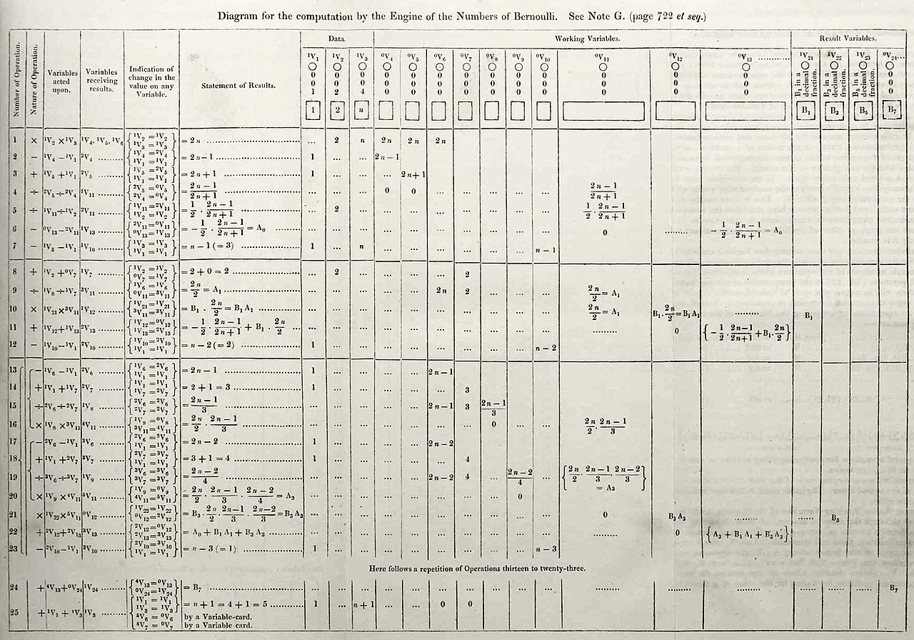
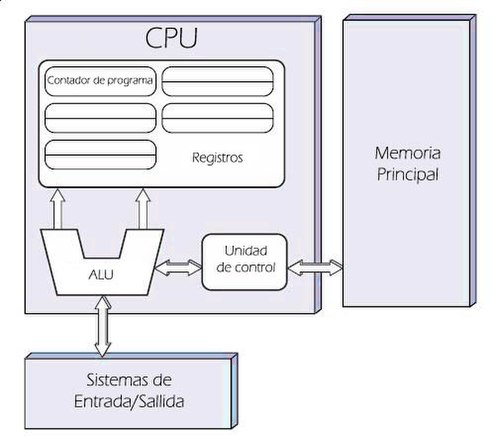
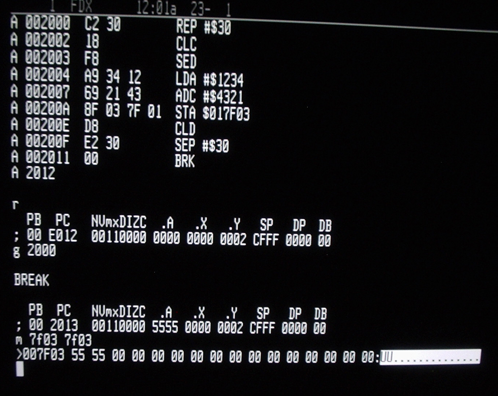

# Introducción a la programación de computadoras

## Trabajo previo

### Lecturas

Antes de la clase, revise las siguientes lecturas, ambas en inglés: son los capítulos iniciales de los dos libros con los que se estudiará el lenguaje Python a partir de la próxima semana. La primera presenta la programación como una forma de pensar; la segunda explica por qué conviene aprender a programar y describe los componentes de una computadora. Como lectura complementaria breve, el artículo de Wing introduce el pensamiento computacional.

Downey, A. B. (2024). Programming as a way of thinking. En *Think Python: How to think like a computer scientist* (3.ª ed.). O'Reilly Media. https://allendowney.github.io/ThinkPython/chap01.html
\
\
Severance, C. R. (2016). Why should you learn to write programs? En *Python for everybody: Exploring data in Python 3* (S. Blumenberg y E. Hauser, eds.). CreateSpace Independent Publishing Platform. https://www.py4e.com/html3/01-intro
\
\
Wing, J. M. (2006). Computational thinking. *Communications of the ACM*, *49*(3), 33–35. [https://dl.acm.org/doi/10.1145/1118178.1118215](https://dl.acm.org/doi/10.1145%2F1118178.1118215)

### Videos

La primera lección del curso CS50 de la Universidad de Harvard (en inglés, con subtítulos) presenta de forma accesible varios de los conceptos de este capítulo, como los sistemas binarios y los algoritmos.

CS50. (2024). *CS50x 2024 – Lecture 0 – Scratch* [video]. YouTube. https://www.youtube.com/watch?v=3LPJfIKxwWc

## Introducción

Las semanas anteriores presentaron las herramientas del curso: los cuadernos de notas, Markdown y el control de versiones. Este capítulo se ocupa del fondo: qué es programar una computadora. Estudia qué pueden hacer las computadoras, qué es un algoritmo y cómo se convierte en un programa, recorre brevemente la historia y la arquitectura de las computadoras y concluye con los lenguajes de programación, como antesala del estudio de Python que comienza la próxima semana.

## Computadoras, algoritmos y programas

### Capacidades de las computadoras

Una **computadora** es una máquina que ejecuta secuencias de instrucciones, denominadas **programas**. Las instrucciones de los programas realizan operaciones de diversos tipos, entre las que pueden mencionarse:

- **Cálculos aritméticos**: sumar, restar, multiplicar, dividir.
- **Procesamiento de texto**: buscar, reemplazar, dividir y concatenar hileras de texto.
- **Operaciones lógicas**: determinar si un número es mayor que otro, si una hilera está contenida en otra o si un elemento está en una lista.
- **Manipulación de datos**: crear, leer, actualizar y eliminar datos en estructuras de datos (ej. listas, matrices) o en bases de datos.
- **Interacción**: recibir entradas (ej. del teclado o del ratón) y mostrar información (ej. en la pantalla o en la impresora).
- **Manejo de archivos**: leer, escribir y modificar archivos.
- **Comunicaciones en red**: enviar y recibir datos a través de una red local o de Internet (ej. páginas web, correos electrónicos).

La capacidad de ser programadas permite modificar el funcionamiento de las computadoras sin alterar sus componentes físicos, lo que las hace aptas para ayudar a resolver una gran variedad de problemas: por eso se dice que son máquinas de **propósito general**, a diferencia de las máquinas construidas para fines específicos. Severance (2016) argumenta que, precisamente por esa versatilidad, aprender a programar es valioso en cualquier disciplina: permite poner la computadora al servicio de las preguntas propias —en este curso, las de la geografía— sin depender de programas escritos por otras personas para otros fines.

### Algoritmos

Para que una computadora ayude a resolver un problema, es necesario expresarlo como un conjunto de pasos claramente definidos. Un **algoritmo** es un conjunto de instrucciones definidas, no ambiguas, ordenadas y finitas que permite solucionar un problema. Los algoritmos son fundamentales en la computación: son la base sobre la que se construyen los programas. Un algoritmo puede ser tan sencillo como una receta de cocina o tan complejo como los que se emplean en [aprendizaje automático](https://es.wikipedia.org/wiki/Aprendizaje_autom%C3%A1tico).

Un algoritmo debe cumplir ciertas características básicas:

1. **Recibir entradas**: los datos con los que trabaja.
2. **Generar salidas**: los resultados de las operaciones que ejecuta.
3. **Tener pasos claros**: la definición de cada paso debe ser precisa y sin ambigüedades.
4. **Ser finito**: debe terminar después de un número finito de pasos.

La habilidad de formular problemas y soluciones de manera que puedan expresarse como algoritmos se conoce como **pensamiento computacional** e incluye estrategias como la descomposición de problemas en partes, el reconocimiento de patrones y la abstracción. Wing (2006) sostiene que es una habilidad fundamental para todas las disciplinas, no solo para la computación.

Un algoritmo puede representarse mediante una descripción escrita, [pseudocódigo](https://es.wikipedia.org/wiki/Pseudoc%C3%B3digo) o un [diagrama de flujo](https://es.wikipedia.org/wiki/Diagrama_de_flujo), entre otras formas. Como ejemplo, se presenta la descripción de un algoritmo para obtener el valor máximo de una lista:

```text
Algoritmo para obtener el valor máximo de una lista
---------------------------------------------------

1. Lea la lista (del teclado, de un archivo o de alguna otra fuente).
2. Si la lista está vacía, despliegue la hilera de texto "Lista vacía"
   y concluya el algoritmo. Si no, continúe con el paso 3.
3. Designe el primer elemento de la lista como "máximo actual".
4. Recorra la lista y compare cada uno de los elementos con el máximo actual.
   4.1. Si un elemento comparado es mayor que el máximo actual,
        entonces desígnelo como el nuevo máximo actual.
5. Al finalizar el recorrido de la lista, imprima el máximo actual
   como valor máximo de la lista.
```

Seguidamente se muestra la aplicación del algoritmo a la lista `[29.6, -36.81, 31.85, 25.71, 90.2, 0.4]`. En cada paso del recorrido, el elemento en **negrita** es el máximo actual y el elemento en *itálica* es el que está siendo comparado:

1. Lista leída: [29.6, -36.81, 31.85, 25.71, 90.2, 0.4]
2. La lista no está vacía, por lo que se continúa con el paso 3.
3. Se designa el primer elemento, 29.6, como el máximo actual.
4. Se recorre la lista comparando cada elemento con el máximo actual:

    [**29.6**, *-36.81*, 31.85, 25.71, 90.2, 0.4]

    [**29.6**, -36.81, *31.85*, 25.71, 90.2, 0.4]

    [29.6, -36.81, **31.85**, *25.71*, 90.2, 0.4]

    [29.6, -36.81, **31.85**, 25.71, *90.2*, 0.4]

    [29.6, -36.81, 31.85, 25.71, **90.2**, *0.4*]

5. Al finalizar el recorrido, se imprime el máximo actual como valor máximo de la lista: 90.2.

Note que el algoritmo tiene un inicio claramente definido (la lectura de la lista) y una condición de finalización (que termine el recorrido), que cada paso intermedio está especificado con claridad —incluidas las condiciones para que se ejecute— y que comprende la lectura de entradas (la lista), su procesamiento (el recorrido y las comparaciones) y la generación de salidas (el valor máximo).

*Ejercicios de esta sección: [ejercicios sobre algoritmos](#ejercicios-algoritmos).*

### El modelo entrada–procesamiento–salida

El modelo **entrada–procesamiento–salida** (*input–process–output*, IPO) describe la estructura básica de un algoritmo o de un programa, como se aprecia en el ejemplo anterior: se reciben entradas, se procesan y se generan salidas. La figura 1 lo esquematiza.

```{mermaid}
flowchart LR
  E([Entrada]) --> P([Procesamiento])
  P --> S([Salida])
```

<p style="text-align: center;"><strong>Figura 1</strong>. Modelo entrada–procesamiento–salida. Elaboración propia.</p>

Sus componentes son:

- **Entrada**: los datos que recibe el algoritmo o programa. Pueden provenir del teclado, de un archivo o de un sensor, entre otras fuentes. La calidad de las entradas afecta directamente la calidad del resultado.
- **Procesamiento**: las operaciones que transforman las entradas —cálculos matemáticos, operaciones lógicas, transformaciones de datos— de acuerdo con un conjunto de instrucciones. Es donde se realiza el "trabajo" principal.
- **Salida**: el resultado del procesamiento, que puede presentarse en la pantalla, escribirse en un archivo o servir como entrada de otro algoritmo o programa.

Para ilustrar el modelo, considere el cálculo de la [densidad de población](https://es.wikipedia.org/wiki/Densidad_de_poblaci%C3%B3n), un indicador de uso constante en geografía. Requiere dos entradas: la población de un territorio y su área (en km²). El procesamiento aplica la fórmula $d = P/A$ y la salida es la densidad, en habitantes por km². Un posible algoritmo es:

```text
1. Lea la población y el área del territorio.
2. Calcule la densidad mediante la fórmula: densidad = población / área.
3. Imprima la densidad.
```

*Ejercicios de esta sección: [ejercicios sobre algoritmos](#ejercicios-algoritmos).*

### De los algoritmos a los programas

El diseño de un algoritmo puede verse como un paso previo a la escritura de un programa, y un mismo algoritmo puede implementarse en diferentes lenguajes de programación. Seguidamente se muestra la implementación del algoritmo del valor máximo en dos lenguajes de uso frecuente en ciencia de datos: [Python](https://www.python.org/) y [R](https://www.r-project.org/).

```python
# Python
# Obtención del valor máximo de una lista

# Entrada
lista = [29.6, -36.81, 31.85, 25.71, 90.2, 0.4]
print("Lista de entrada:", lista)

# Procesamiento
if len(lista) == 0:
    print("La lista está vacía")
else:
    maximo = lista[0]
    i = 0
    while i < len(lista):
        if lista[i] > maximo:
            maximo = lista[i]
        i = i + 1

    # Salida
    print("Valor máximo de la lista:", maximo)
```

```r
# R
# Obtención del valor máximo de una lista

# Entrada
lista <- c(29.6, -36.81, 31.85, 25.71, 90.2, 0.4)
cat("Lista de entrada:", lista, "\n")

# Procesamiento
if (length(lista) == 0) {
  cat("La lista está vacía", "\n")
} else {
  maximo <- lista[1]
  i <- 1
  while (i <= length(lista)) {
    if (lista[i] > maximo) {
      maximo <- lista[i]
    }
    i <- i + 1
  }

  # Salida
  cat("Valor máximo de la lista:", maximo, "\n")
}
```

Aunque la sintaxis difiere —se estudiará la de Python a partir de la próxima semana—, ambos programas siguen exactamente los mismos pasos del algoritmo, con las secciones de entrada, procesamiento y salida señaladas en comentarios. Cabe aclarar que tanto Python como R ya incluyen funciones que obtienen el máximo de una lista (`max()`); el ejemplo lo implementa paso a paso con fines didácticos.

*Ejercicios de esta sección: [ejercicios sobre programas](#ejercicios-programas).*

## Breve historia de las computadoras

Las computadoras descienden de una larga línea de máquinas de calcular. En el siglo XVII, [Blaise Pascal](https://es.wikipedia.org/wiki/Blaise_Pascal) y [Gottfried Leibniz](https://es.wikipedia.org/wiki/Gottfried_Leibniz) construyeron calculadoras mecánicas capaces de realizar operaciones aritméticas, cuyos derivados continuaron produciéndose durante tres siglos. El salto conceptual llegó en el siglo XIX con la [máquina analítica](https://es.wikipedia.org/wiki/M%C3%A1quina_anal%C3%ADtica) del matemático inglés [Charles Babbage](https://es.wikipedia.org/wiki/Charles_Babbage): una computadora mecánica —nunca terminada, por limitaciones técnicas y económicas— considerada la primera programable de la historia. Para esa máquina, la matemática británica [Ada Lovelace](https://es.wikipedia.org/wiki/Ada_Lovelace) publicó en 1843 los pasos con los que podrían calcularse los [números de Bernoulli](https://es.wikipedia.org/wiki/N%C3%BAmero_de_Bernoulli), considerados el primer programa de computadora publicado (figura 2). Lovelace fue, además, la primera persona en reconocer que estas máquinas podían ir más allá del cálculo numérico: anticipó que en el futuro podrían componer música o generar gráficos.

<figure style="text-align: center;">
  
  <figcaption><strong>Figura 2</strong>. Diagrama del algoritmo para el cálculo de los números de Bernoulli en la máquina analítica. Fuente: Ada Lovelace, a través de <a href="https://commons.wikimedia.org/wiki/File:Diagram_for_the_computation_of_Bernoulli_numbers.jpg">Wikimedia Commons</a>.</figcaption>
</figure>

En 1936, el matemático británico [Alan Turing](https://es.wikipedia.org/wiki/Alan_Turing), considerado uno de los padres de la computación moderna, propuso la **máquina de Turing**: un modelo matemático —no un dispositivo físico— que manipula símbolos en una cinta según una tabla de reglas y que, pese a su simpleza, puede ejecutar cualquier algoritmo si dispone del tiempo y los recursos necesarios. La figura 3 muestra una representación artística. Un sistema con esa capacidad —como una computadora o un lenguaje de programación de propósito general— se dice [Turing-completo](https://es.wikipedia.org/wiki/Turing_completo). Las primeras computadoras electrónicas se construyeron durante la Segunda Guerra Mundial: [Colossus](https://es.wikipedia.org/wiki/Colossus), en el Reino Unido, para descifrar mensajes codificados, y [ENIAC](https://es.wikipedia.org/wiki/ENIAC), terminada en 1945 en Estados Unidos y considerada la primera computadora electrónica digital de propósito general.

<figure style="text-align: center;">
  
  <figcaption><strong>Figura 3</strong>. Representación artística de la máquina de Turing. Fuente: Porao, a través de <a href="https://commons.wikimedia.org/wiki/File:Turing_Machine.png">Wikimedia Commons</a>.</figcaption>
</figure>

## La computadora moderna

En 1945, el matemático húngaro-estadounidense [John von Neumann](https://es.wikipedia.org/wiki/John_von_Neumann) propuso el concepto de [programa almacenado](https://es.wikipedia.org/wiki/Computador_de_programa_almacenado): los programas se guardan en la memoria, junto con los datos, lo que hace a las computadoras mucho más fáciles de reprogramar. Este modelo, conocido como **arquitectura de von Neumann**, es la base de las computadoras actuales (Severance, 2016) y comprende tres componentes: la **memoria principal** (RAM), que almacena los programas en ejecución y los datos que estos utilizan; la **unidad central de procesamiento** (CPU), que ejecuta las instrucciones; y los **sistemas de entrada y salida**, que comunican la computadora con el mundo exterior (ej. teclado, pantalla, discos, red). Su esquema se muestra en la figura 4.

<figure style="text-align: center;">
  
  <figcaption><strong>Figura 4</strong>. Arquitectura de von Neumann. Fuente: David Strigoi, a través de <a href="https://commons.wikimedia.org/wiki/File:Arquitecturaneumann.jpg">Wikimedia Commons</a>.</figcaption>
</figure>

Para el trabajo con datos conviene retener la distinción entre la memoria principal —rápida, pero limitada y volátil: su contenido se pierde al apagar la computadora— y el almacenamiento en disco —persistente y de mayor capacidad—. Un programa típico lee los datos del disco, los procesa en la memoria y escribe los resultados de vuelta en el disco; por eso un conjunto de datos puede "no caber" en la memoria aunque quepa holgadamente en el disco, situación frecuente con datos geoespaciales voluminosos, como las imágenes satelitales.

Internamente, las computadoras representan toda la información —números, texto, imágenes, sonido— en forma **binaria**: con dos valores, denotados 0 y 1. Cada dígito binario se denomina **bit** (*binary digit*) y los bits se agrupan de ocho en ocho en [*bytes*](https://es.wikipedia.org/wiki/Byte). De ahí provienen las unidades con las que se mide el tamaño de los datos (kilobytes, megabytes, gigabytes) y algunos detalles que reaparecerán en el curso: los tipos numéricos como `int64` y `float64`, que se estudiarán con pandas, ocupan 64 bits (8 bytes) por valor, y los caracteres de texto se representan mediante codificaciones como [ASCII](https://es.wikipedia.org/wiki/ASCII) y [UTF-8](https://es.wikipedia.org/wiki/UTF-8) — conocer su existencia ayuda a entender, por ejemplo, los errores con tildes y eñes al leer archivos de datos.

La CPU solo ejecuta directamente instrucciones binarias, el llamado **código máquina**: el único lenguaje que las computadoras "entienden", específico de cada arquitectura de procesador (ej. x86, ARM). La figura 5 muestra un programa en código máquina examinado en la pantalla de una computadora: cada línea presenta una dirección de memoria, los bytes de una instrucción —en [notación hexadecimal](https://es.wikipedia.org/wiki/Sistema_hexadecimal), una forma compacta de escribir números binarios— y su traducción a una notación legible.

<figure style="text-align: center;">
  
  <figcaption><strong>Figura 5</strong>. Programa en código máquina examinado en el monitor de una computadora W65C816S. Fuente: BigDumbDinosaur (BCS Technology Limited), a través de <a href="https://commons.wikimedia.org/wiki/File:W65C816S_Machine_Code_Monitor.jpeg">Wikimedia Commons</a>.</figcaption>
</figure>

## Lenguajes de programación

Programar directamente en código máquina es lento y propenso a errores. Por eso, a partir de la década de 1950 comenzaron a crearse los **lenguajes de programación**: notaciones que expresan las instrucciones con palabras —usualmente en inglés— y símbolos, y que programas especiales traducen a código máquina. Como ejemplo, el programa ["Hola mundo"](https://es.wikipedia.org/wiki/Hola_mundo) —que se limita a imprimir esa hilera de texto y es, tradicionalmente, el primer ejemplo con el que se estudia un lenguaje— se muestra a continuación en tres lenguajes: [C](https://es.wikipedia.org/wiki/C_(lenguaje_de_programaci%C3%B3n)), Python y R.

```c
/* Hola mundo en lenguaje C */

#include <stdio.h>

int main(void)
{
    printf("Hola mundo\n");
}
```

```python
# Hola mundo en lenguaje Python

print("Hola mundo")
```

```r
# Hola mundo en lenguaje R

cat("Hola mundo\n")
```

Existe una gran [variedad de lenguajes de programación](https://es.wikipedia.org/wiki/Anexo:Lenguajes_de_programaci%C3%B3n), creados con fines científicos, comerciales o educativos, entre otros; el sitio [The Hello World Collection](https://helloworldcollection.github.io/) reúne el programa "Hola mundo" en más de 600 de ellos. En este curso se estudia Python, cuya sintaxis, tipos de datos y estructuras se comienzan a ver en la próxima semana.

*Ejercicios de esta sección: [ejercicios sobre programas](#ejercicios-programas).*

## Resumen

- Una **computadora** es una máquina de **propósito general**: ejecuta programas que pueden cambiarse sin alterar sus componentes físicos. Aprender a programarla permite ponerla al servicio de las preguntas de la propia disciplina.
- Un **algoritmo** es un conjunto de pasos definidos, no ambiguos, ordenados y finitos que soluciona un problema; recibe entradas, las procesa y genera salidas (modelo **entrada–procesamiento–salida**). Formular problemas de esta manera es la esencia del **pensamiento computacional**.
- Un mismo algoritmo puede implementarse como **programa** en distintos lenguajes de programación.
- La historia de las computadoras va de las calculadoras mecánicas y la máquina analítica de Babbage —para la que Ada Lovelace publicó el primer programa— al modelo teórico de Turing y a las primeras computadoras electrónicas; las actuales siguen la **arquitectura de von Neumann**: memoria principal, CPU y sistemas de entrada y salida. Para el trabajo con datos importa la distinción entre la memoria —rápida, limitada y volátil— y el disco —persistente y de mayor capacidad—.
- Internamente, las computadoras representan la información en forma **binaria** —el bit y el byte, de donde provienen las unidades de tamaño de los datos, los tipos numéricos como `int64` y las codificaciones de texto como UTF-8— y ejecutan **código máquina**; los **lenguajes de programación**, como Python, permiten escribir instrucciones legibles que se traducen a ese código.

## Ejercicios

Los ejercicios se agrupan según la sección del capítulo a la que corresponden; se recomienda realizarlos al concluir la sección respectiva. Las [soluciones de estos ejercicios](../soluciones/06-soluciones-introduccion-programacion.md) se publican después de la clase correspondiente.

(ejercicios-algoritmos)=
### Algoritmos

1. Escriba, en pasos numerados como los del ejemplo, un algoritmo para obtener el valor **mínimo** de una lista. Verifique que cumpla las cuatro características básicas (entradas, salidas, pasos claros, finitud) y aplíquelo manualmente a la lista `[8.5, 3.2, -4.7, 10.9, 0.6]`, mostrando el "mínimo actual" en cada paso del recorrido.
2. Elabore una hoja electrónica que calcule la densidad de población de los cantones de una provincia de Costa Rica (busque la población y el área de al menos cinco cantones en fuentes oficiales, como el [Instituto Nacional de Estadística y Censos](https://inec.cr/)). Identifique en la hoja los componentes de entrada, procesamiento y salida del modelo.

(ejercicios-programas)=
### Programas

3. Ejecute el programa del valor máximo en ambos lenguajes: el de Python en un cuaderno de [Google Colab](https://colab.research.google.com/) y el de R en un [ambiente de ejecución en línea](https://www.mycompiler.io/new/r). Solo debe copiar el código y ejecutarlo; compare las salidas.
4. Modifique el programa de Python para que obtenga el valor mínimo, implementando el algoritmo que diseñó en el ejercicio 1, y ejecútelo en Colab.
5. Escriba en Python un programa que calcule la densidad de población de un territorio, siguiendo el algoritmo de la sección del modelo entrada–procesamiento–salida: defina las variables `poblacion` y `area` con valores reales de un cantón, calcule la densidad e imprímala con `print()`.

## Referencias bibliográficas

CS50. (2024). *CS50x 2024 – Lecture 0 – Scratch* [video]. YouTube. https://www.youtube.com/watch?v=3LPJfIKxwWc
\
\
Downey, A. B. (2024). Programming as a way of thinking. En *Think Python: How to think like a computer scientist* (3.ª ed.). O'Reilly Media. https://allendowney.github.io/ThinkPython/chap01.html
\
\
Severance, C. R. (2016). Why should you learn to write programs? En *Python for everybody: Exploring data in Python 3* (S. Blumenberg y E. Hauser, eds.). CreateSpace Independent Publishing Platform. https://www.py4e.com/html3/01-intro
\
\
Wing, J. M. (2006). Computational thinking. *Communications of the ACM*, *49*(3), 33–35. [https://dl.acm.org/doi/10.1145/1118178.1118215](https://dl.acm.org/doi/10.1145%2F1118178.1118215)
