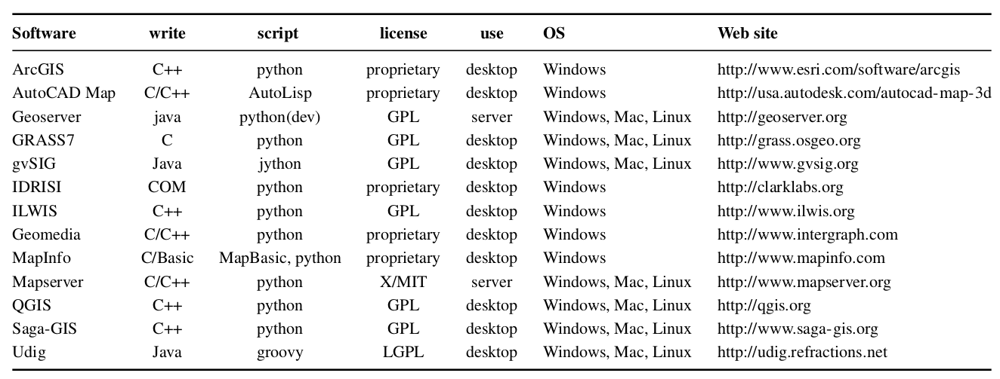

# Introducción a Python

## Trabajo previo

### Lecturas

Antes de la clase, revise las siguientes lecturas. La primera, en español, es el capítulo inicial del tutorial oficial de Python y explica para qué sirve el lenguaje; la segunda, en inglés y de carácter opcional, es un ensayo del creador de Python sobre el origen del lenguaje.

Python Software Foundation. (s. f.). Abriendo el apetito. En *El tutorial de Python*. Recuperado el 21 de agosto de 2026, de https://docs.python.org/es/3/tutorial/appetite.html
\
\
van Rossum, G. (1996). *Foreword for "Programming Python" (1st ed.)*. Python Software Foundation. https://www.python.org/doc/essays/foreword/

### Otros recursos

Revise además la [guía de Miniconda](../software/miniconda.md) del sitio del curso y, de ser posible, llegue a la clase con el instalador de Miniconda ya descargado —o instalado—: la instalación local de Python se realiza esta semana y así se aprovecha mejor el tiempo de la clase.

## Introducción

La lección de [introducción a la programación de computadoras](../i-introduccion-ciencia-datos-programacion/06-introduccion-programacion.md) concluyó con los lenguajes de programación: notaciones legibles que se traducen a código máquina. Este capítulo abre la unidad dedicada al lenguaje elegido en este curso: [Python](https://www.python.org/). Presenta su historia, sus características y principios de diseño, la comunidad que lo desarrolla y las razones de su importancia en los sistemas de información geográfica, y concluye con las dos formas de ejecutarlo en el curso: en la nube, con Google Colab, y en la computadora local, mediante la instalación que se realiza esta semana.

## Historia

Python fue creado por el programador neerlandés [Guido van Rossum](https://gvanrossum.github.io/) (figura 1), quien concibió el diseño original del lenguaje a finales de la década de 1980 y publicó la primera versión en 1991. Según relata van Rossum (1996), en diciembre de 1989 buscaba un proyecto de programación como "pasatiempo" durante los días cercanos a la Navidad, por lo que decidió escribir el interpretador de un lenguaje en el que había estado pensando. El nombre del lenguaje no alude a la serpiente, sino que es un homenaje al grupo de comedia británico [Monty Python](https://es.wikipedia.org/wiki/Monty_Python): van Rossum escogió el nombre por encontrarse en un "humor ligeramente irreverente" y ser un gran aficionado a su programa de televisión [*Monty Python's Flying Circus*](https://es.wikipedia.org/wiki/Monty_Python%27s_Flying_Circus).

<figure style="text-align: center;">
  
  <figcaption><strong>Figura 1</strong>. Guido van Rossum, creador de Python, en 2014. Fuente: Daniel Stroud, a través de <a href="https://commons.wikimedia.org/wiki/File:Guido-portrait-2014-drc.jpg">Wikimedia Commons</a> (CC BY-SA 4.0).</figcaption>
</figure>

La "cultura" de Python hace referencias ocasionales a Monty Python en tutoriales, ejemplos y otros materiales. Por ejemplo, en el uso de *spam*, *ham* y *eggs* como [variables metasintácticas](https://en.wikipedia.org/wiki/Metasyntactic_variable) —nombres genéricos para los ejemplos de código— en sustitución de las tradicionales *foo*, *bar* y *baz*, en alusión al *sketch* [Spam](https://www.youtube.com/watch?v=_bW4vEo1F4E).

La versión 3.0 de Python se publicó en 2008 e introdujo cambios importantes que la hicieron incompatible con Python 2. Ambas versiones coexistieron durante más de una década, hasta que Python 2 alcanzó su [fin de vida](https://www.python.org/doc/sunset-python-2/) en enero de 2020. En la actualidad se usa exclusivamente Python 3, con versiones nuevas cada año; la serie estable más reciente es la 3.14, que es también la incluida en el ambiente del curso. La figura 2 resume estos hitos.

```{mermaid}
flowchart LR
  A([1989: van Rossum concibe<br>el diseño de Python]) --> B([1991: primera versión<br>pública, la 0.9.0])
  B --> C([2008: Python 3.0,<br>incompatible con Python 2])
  C --> D([2020: fin de vida<br>de Python 2])
  D --> E([2025: Python 3.14, la serie<br>del ambiente del curso])
```

<p style="text-align: center;"><strong>Figura 2</strong>. Hitos en la historia de Python. Elaboración propia con base en van Rossum (1996) y Python Software Foundation (s. f.).</p>

## Características

Python es un lenguaje de **propósito general**: se emplea en ciencia de datos, [aprendizaje automático](https://es.wikipedia.org/wiki/Aprendizaje_autom%C3%A1tico), desarrollo web y automatización de tareas, entre muchas otras áreas. Esa versatilidad lo ha llevado a los primeros lugares de los índices de popularidad de lenguajes de programación: el índice [TIOBE](https://www.tiobe.com/tiobe-index/) lo declaró lenguaje del año en 2024 y lo ubica en el primer lugar de su clasificación. Es también uno de los lenguajes más empleados en la enseñanza de la programación: ya en 2014 era el más usado en los cursos introductorios de las principales universidades de Estados Unidos (Guo, 2014), en buena parte porque los programas en Python son más fáciles de leer y requieren menos líneas de código que los de otros lenguajes de amplia difusión, como Java, C o C++ — algo que puede comprobarse comparando los programas "Hola mundo" en C y en Python de la [lección anterior](../i-introduccion-ciencia-datos-programacion/06-introduccion-programacion.md).

Otras características importantes del lenguaje son:

- Es **interpretado**: sus instrucciones se traducen a [código máquina](../i-introduccion-ciencia-datos-programacion/06-introduccion-programacion.md) y se ejecutan una por una, a diferencia de los lenguajes **compilados** (como C), en los que un programa llamado [compilador](https://es.wikipedia.org/wiki/Compilador) traduce de una vez el programa completo antes de ejecutarlo. Los lenguajes interpretados tienden a ser más lentos, pero resultan más flexibles para el desarrollo interactivo, como el de los cuadernos de notas: es lo que permite ejecutar una celda a la vez.
- Tiene **tipos de datos dinámicos**: una variable puede tomar valores de diferentes tipos (ej. numéricos, textuales) durante la ejecución del programa, a diferencia del [tipado estático](https://es.wikipedia.org/wiki/Sistema_de_tipos#Tipado_est%C3%A1tico), en el que cada variable declara un tipo fijo. Esto simplifica la escritura de los programas, aunque exige atención a los tipos, como se verá en la próxima lección.
- Cuenta con **administración automática de memoria**: el interpretador asigna y libera la memoria de las variables sin intervención de quien programa, mediante un sistema de [recolección de basura](https://es.wikipedia.org/wiki/Recolector_de_basura).
- Soporta varios [**paradigmas de programación**](https://es.wikipedia.org/wiki/Paradigma_de_programaci%C3%B3n) —estilos o enfoques de programación—, entre ellos la [programación imperativa](https://es.wikipedia.org/wiki/Programaci%C3%B3n_imperativa), la [orientada a objetos](https://es.wikipedia.org/wiki/Programaci%C3%B3n_orientada_a_objetos) y la [funcional](https://es.wikipedia.org/wiki/Programaci%C3%B3n_funcional).
- Es **multiplataforma**: se ejecuta en los sistemas operativos más populares (ej. Windows, macOS, Linux).
- Se distribuye como [software de código abierto](https://es.wikipedia.org/wiki/C%C3%B3digo_abierto), con la licencia [Python Software Foundation License](https://es.wikipedia.org/wiki/Python_Software_Foundation_License), que permite usarlo, estudiarlo y redistribuirlo libremente, incluso con fines comerciales.

## Principios de diseño

La filosofía de diseño de Python enfatiza que los programas sean fáciles de leer, de manera que pueda entenderse rápidamente su propósito y funcionamiento. Esto facilita el mantenimiento de los programas existentes y disminuye la necesidad de crear otros nuevos. Los documentos que expresan esa filosofía son dos [**PEP** (*Python Enhancement Proposals*)](https://peps.python.org/): los documentos públicos y numerados en los que la comunidad de Python propone, discute y registra los cambios y las convenciones del lenguaje — otra muestra del modelo abierto y comunitario con el que se desarrolla.

### El Zen de Python

El [**Zen de Python**](https://peps.python.org/pep-0020/) (PEP 20) resume la filosofía del lenguaje en 19 principios breves, escritos por el programador estadounidense Tim Peters, una de las figuras históricas de la comunidad de Python (Peters, 2004). Está incluido en el propio lenguaje como un [*huevo de pascua*](https://es.wikipedia.org/wiki/Huevo_de_pascua_(virtual)): se despliega, en su inglés original, al ejecutar la instrucción `import this`. La tabla 1 presenta una selección de los principios más relevantes para este curso, con una lectura práctica de cada uno.

<figure style="text-align: center; margin: 20px 0;">
    <figcaption><strong>Tabla 1</strong>. Selección de principios del Zen de Python. Elaboración propia con base en Peters (2004).</figcaption>
    <table class="table table-bordered table-striped" style="margin: 0 auto;">
        <thead>
            <tr>
                <th>Principio (original)</th>
                <th>Traducción</th>
                <th>En la práctica</th>
            </tr>
        </thead>
        <tbody>
            <tr>
                <td><em>Beautiful is better than ugly</em></td>
                <td>Lo bello es mejor que lo feo</td>
                <td>La estética del código importa: un programa ordenado se entiende y se corrige con más facilidad</td>
            </tr>
            <tr>
                <td><em>Explicit is better than implicit</em></td>
                <td>Explícito es mejor que implícito</td>
                <td>El código debe decir claramente qué hace, empezando por los nombres de las variables, sin depender de comportamientos ocultos</td>
            </tr>
            <tr>
                <td><em>Simple is better than complex</em></td>
                <td>Lo simple es mejor que lo complejo</td>
                <td>Entre dos soluciones que funcionan, conviene la más sencilla</td>
            </tr>
            <tr>
                <td><em>Readability counts</em></td>
                <td>La legibilidad cuenta</td>
                <td>El código se lee muchas más veces de las que se escribe: se escribe para las personas, no solo para la computadora</td>
            </tr>
            <tr>
                <td><em>Errors should never pass silently</em></td>
                <td>Los errores nunca deberían pasar en silencio</td>
                <td>Es preferible que un error se manifieste y se maneje a que se oculte; se aplicará al estudiar las excepciones, en el próximo cuaderno</td>
            </tr>
            <tr>
                <td><em>There should be one-- and preferably only one --obvious way to do it</em></td>
                <td>Debería haber una —y preferiblemente solo una— manera obvia de hacerlo</td>
                <td>El lenguaje favorece las soluciones convencionales, que cualquier persona puede reconocer</td>
            </tr>
            <tr>
                <td><em>If the implementation is hard to explain, it's a bad idea</em></td>
                <td>Si la implementación es difícil de explicar, es una mala idea</td>
                <td>Poder explicar el propio código es señal de comprenderlo — el mismo criterio que los lineamientos de IA del curso (lección 7) aplican al código producido con asistentes</td>
            </tr>
        </tbody>
    </table>
</figure>

### La guía de estilo PEP 8

Los principios se concretan en la [guía de estilo para código Python](https://peps.python.org/pep-0008/), conocida como **PEP 8** (van Rossum et al., 2001), que establece convenciones para escribir programas. Las que se aplican desde ya en el curso son:

- Nombres de variables **significativos**, en minúsculas y con guiones bajos para separar palabras (ej. `densidad_poblacion`).
- Un espacio a cada lado de los operadores (`=`, `+`, `>`) y después de cada coma.
- Indentación con cuatro espacios (se aplicará con los condicionales, en el próximo cuaderno).
- Líneas de no más de 79 caracteres.
- Comentarios que expliquen lo que el código no dice por sí mismo y que se actualicen junto con él.

El efecto de estas convenciones se aprecia comparando dos versiones del mismo programa. La primera funciona, pero ignora la guía de estilo:

```python
p=352381
A  =44.6
print("densidad:",p/A)
```

La segunda hace lo mismo, con las convenciones de PEP 8:

```python
# Densidad de población del cantón de San José (INEC, Censo 2022)
poblacion = 352381
area = 44.6

print("Densidad (hab/km2):", poblacion / area)
```

Ambas producen la misma salida; la diferencia es para quien lee: en la segunda versión, los nombres, los espacios y el comentario cuentan qué hace el programa y de dónde vienen los datos.

### Código pitónico

Los programas que siguen estos principios, junto con las mejores prácticas y los [*idioms*](https://en.wikipedia.org/wiki/Programming_idiom) del lenguaje —como los recopilados en [The Hitchhiker's Guide to Python](https://docs.python-guide.org/)—, se consideran "pitónicos" (*pythonic*), y la comunidad llama *pythonistas* a las personas que programan según esta filosofía.

*Ejercicios de esta sección: [ejercicios sobre los principios de diseño](#ejercicios-principios).*

## Comunidad y bibliotecas

La [Python Software Foundation (PSF)](https://www.python.org/psf/) es la organización sin fines de lucro que posee los derechos de propiedad intelectual del lenguaje y administra sus licencias. Su misión es *"promover, proteger y avanzar el lenguaje de programación Python, así como apoyar y facilitar el crecimiento de una comunidad diversa e internacional de quienes programan en Python"*.

La implementación de referencia del interpretador, llamada [CPython](https://github.com/python/cpython), es software de código abierto, lo que permite que el desarrollo del lenguaje sea conducido por una comunidad mundial enlazada a través de Internet. Esa misma comunidad produce las **bibliotecas** que extienden el lenguaje: colecciones de código reutilizable —también llamadas **paquetes**— que resuelven tareas específicas, como las que se usarán en este curso para análisis de datos y para datos geoespaciales. El principal repositorio para compartirlas es el [Python Package Index (PyPI)](https://pypi.org/), que alberga más de 800 000 proyectos; el ambiente conda del curso instala las bibliotecas desde un repositorio análogo, [conda-forge](https://conda-forge.org/).

*Ejercicios de esta sección: [ejercicios sobre la comunidad y las bibliotecas](#ejercicios-comunidad).*

## Python en los SIG

Python tiene una gran importancia en el software geoespacial, debido a su popularidad, la facilidad con la que puede aprenderse y la abundancia de recursos de consulta (ej. tutoriales, libros, foros de discusión). Todas estas características lo hacen muy apropiado para quienes programan sin ser especialistas en computación, como ocurre con muchas de las personas usuarias de los [sistemas de información geográfica (SIG)](https://es.wikipedia.org/wiki/Sistema_de_informaci%C3%B3n_geogr%C3%A1fica). De hecho, los SIG más difundidos adoptaron Python como el lenguaje con el que las personas usuarias amplían y automatizan la funcionalidad que ofrecen (Zambelli et al., 2013): las bibliotecas [ArcPy](https://pro.arcgis.com/en/pro-app/latest/arcpy/main/arcgis-pro-arcpy-reference.htm) para [ArcGIS](https://www.arcgis.com/), [PyQGIS](https://docs.qgis.org/latest/en/docs/pyqgis_developer_cookbook/) para [QGIS](https://www.qgis.org/) y [PyGRASS](https://grass.osgeo.org/grass-stable/manuals/libpython/pygrass_index.html) para [GRASS GIS](https://grass.osgeo.org/) (figura 3).

<figure style="text-align: center;">
  
  <figcaption><strong>Figura 3</strong>. Uso de Python en software para manejo de datos geoespaciales. Fuente: Zambelli et al. (2013).</figcaption>
</figure>

Quien ha usado QGIS, por ejemplo, ya tiene Python en su computadora sin saberlo: el programa lo incorpora y ofrece una consola de Python (menú *Complementos > Consola de Python*) en la que puede ejecutarse código como el que se estudia en este curso.

Además, existen numerosas bibliotecas de Python independientes de los SIG de escritorio para el manejo de datos geoespaciales. Varias de ellas se estudian en este curso y ya están instaladas en su ambiente conda: geopandas para datos vectoriales, rasterio para datos raster, folium y leafmap para mapas interactivos. Ese ecosistema, sumado a las bibliotecas generales de ciencia de datos (pandas, matplotlib, plotly), es la razón por la que este curso se desarrolla en Python.

*Ejercicios de esta sección: [ejercicios sobre la comunidad y las bibliotecas](#ejercicios-comunidad).*

## Ejecución de Python en el curso

En el curso, los programas en Python se ejecutan de dos maneras complementarias:

- **En la nube, con [Google Colab](../software/colab.md)**: como se ha hecho desde la primera semana con los cuadernos de notas, sin instalar nada localmente.
- **En la computadora local, con [Miniconda](../software/miniconda.md)**: a partir de esta semana, el curso instala Python mediante la plataforma Miniconda y el ambiente virtual `geopython`, definido en el archivo `environment.yml` del repositorio del curso. Los cuadernos locales se trabajan en [Visual Studio Code](../software/vscode.md), seleccionando ese ambiente como kernel.

Los pasos de instalación están en la [guía de Miniconda](../software/miniconda.md), que también explica qué son conda y los ambientes virtuales y cómo se relacionan con la reproducibilidad estudiada en el curso.

*Ejercicios de esta sección: [ejercicios sobre la instalación local](#ejercicios-instalacion).*

## Resumen

- **Python** es un lenguaje de programación de propósito general creado por Guido van Rossum y publicado por primera vez en 1991. Es uno de los lenguajes más populares y de los más usados para enseñar programación, en buena parte por su **legibilidad**.
- Es un lenguaje **interpretado**, con **tipos de datos dinámicos**, **administración automática de memoria**, soporte de varios **paradigmas** y distribución de **código abierto**.
- Su filosofía de diseño está documentada en los **PEP**, los documentos públicos con los que la comunidad registra los cambios y convenciones del lenguaje: el **Zen de Python** (PEP 20) la resume en 19 principios y la guía de estilo **PEP 8** la concreta en convenciones de escritura; los programas que las siguen se consideran "pitónicos".
- Una comunidad mundial, coordinada por la **Python Software Foundation**, desarrolla el lenguaje y sus **bibliotecas**, compartidas en repositorios como PyPI y conda-forge.
- Python es el lenguaje de automatización y extensión de los principales **SIG** (ArcGIS, QGIS, GRASS) y cuenta con bibliotecas geoespaciales independientes (geopandas, rasterio, folium), lo que lo convierte en el lenguaje de este curso.
- En el curso, Python se ejecuta en la nube (Google Colab) y, a partir de esta semana, localmente (Miniconda y el ambiente `geopython`, con VS Code).

## Ejercicios

Los ejercicios se agrupan según la sección del capítulo a la que corresponden; se recomienda realizarlos al concluir la sección respectiva.

(ejercicios-principios)=
### Principios de diseño

1. En un cuaderno de [Google Colab](https://colab.research.google.com/), ejecute en una celda de código la instrucción `import this` para desplegar el Zen de Python. Elija dos de sus principios —pueden ser de la tabla 1 o de los restantes— y, en una celda de texto, explíquelos con sus propias palabras y relaciónelos con lo que este capítulo dice sobre la legibilidad de los programas.

2. El siguiente programa funciona, pero ignora las convenciones de PEP 8. En una celda de código, reescríbalo aplicando las convenciones estudiadas en esta sección (nombres significativos, espacios, comentario con la fuente de los datos) y verifique que produce el mismo resultado. Los datos son la población de Costa Rica según el Censo 2022 del [INEC](https://inec.cr/) y el área del país en km².

    ```python
    x=5044197
    Y  =51100
    print("la densidad de poblacion de costa rica es",x/Y)
    ```

(ejercicios-comunidad)=
### Comunidad y bibliotecas

3. Explore el [Python Package Index (PyPI)](https://pypi.org/) buscando bibliotecas relacionadas con el tema geográfico que considera desarrollar en el proyecto del curso (ej. "biodiversity", "climate", "remote sensing", "geospatial"). Elija una y anote, en el mismo cuaderno del ejercicio anterior: su nombre, qué hace (según su descripción) y la fecha de su versión más reciente, como indicador de si el proyecto se mantiene activo.

(ejercicios-instalacion)=
### Instalación local

4. Instale Miniconda y cree el ambiente `geopython` siguiendo la [guía de Miniconda](../software/miniconda.md). Verifique la instalación con los comandos `conda env list` (el ambiente debe aparecer en la lista) y, con el ambiente activado, `python --version`.
5. En Visual Studio Code, cree un cuaderno de notas nuevo, seleccione el ambiente `geopython` como kernel —según la [guía de VS Code](../software/vscode.md)— y ejecute una celda con el programa "Hola mundo" de la [lección anterior](../i-introduccion-ciencia-datos-programacion/06-introduccion-programacion.md). Agregue otra celda con las instrucciones `import sys` y `print(sys.version)` y compare la versión desplegada con la del ejercicio 4.

## Referencias bibliográficas

Guo, P. (2014, 7 de julio). Python is now the most popular introductory teaching language at top U.S. universities. *Blog@CACM*. https://cacm.acm.org/blogcacm/python-is-now-the-most-popular-introductory-teaching-language-at-top-u-s-universities/
\
\
Peters, T. (2004). *PEP 20 – The Zen of Python*. Python Enhancement Proposals. https://peps.python.org/pep-0020/
\
\
Python Software Foundation. (s. f.). Abriendo el apetito. En *El tutorial de Python*. Recuperado el 21 de agosto de 2026, de https://docs.python.org/es/3/tutorial/appetite.html
\
\
TIOBE. (s. f.). *TIOBE index*. Recuperado el 21 de agosto de 2026, de https://www.tiobe.com/tiobe-index/
\
\
van Rossum, G. (1996). *Foreword for "Programming Python" (1st ed.)*. Python Software Foundation. https://www.python.org/doc/essays/foreword/
\
\
van Rossum, G., Warsaw, B. y Coghlan, A. (2001). *PEP 8 – Style guide for Python code*. Python Enhancement Proposals. https://peps.python.org/pep-0008/
\
\
Zambelli, P., Gebbert, S. y Ciolli, M. (2013). PyGRASS: An object oriented Python application programming interface (API) for Geographic Resources Analysis Support System (GRASS) geographic information system (GIS). *ISPRS International Journal of Geo-Information*, *2*(1), 201–219. https://www.mdpi.com/2220-9964/2/1/201
