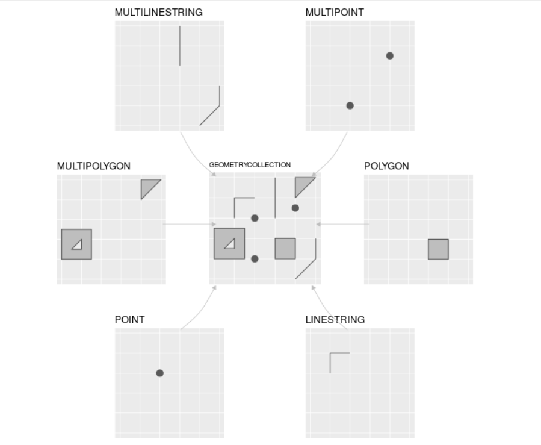
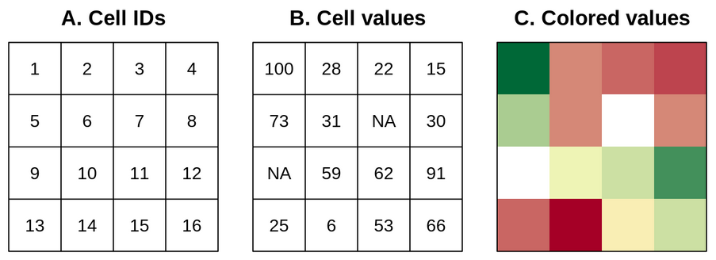
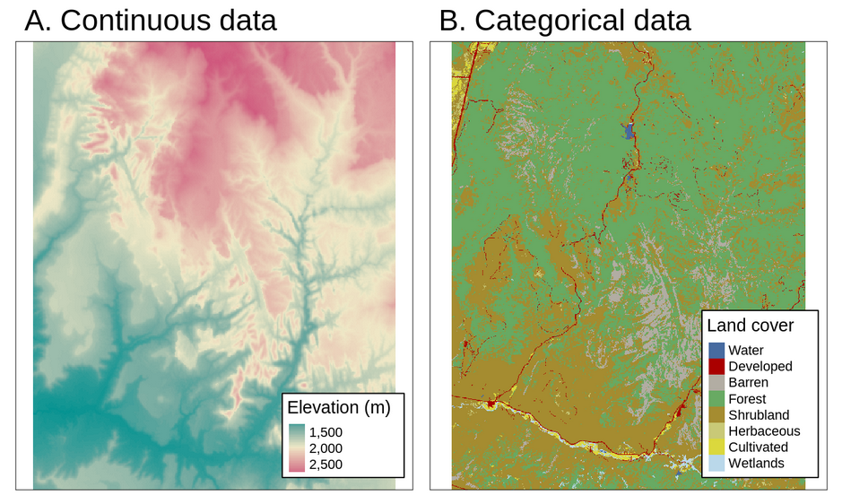
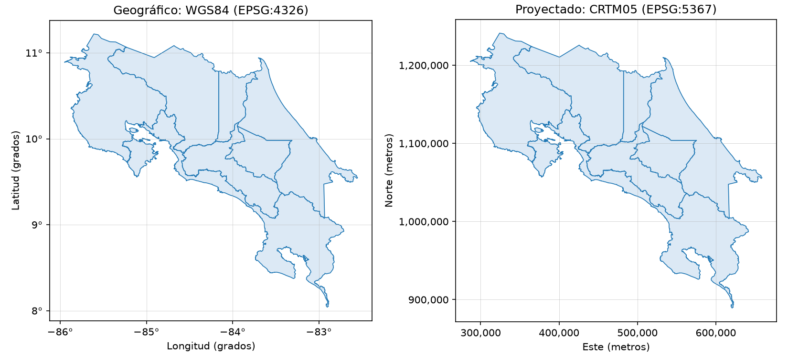

# Datos geoespaciales: modelos, formatos y sistemas de referencia de coordenadas

## Trabajo previo

### Lecturas

Antes de la clase, revise las siguientes lecturas. El capítulo de Olaya, en español, presenta los dos modelos de datos geoespaciales; el de Lovelace et al. los desarrolla con más detalle, en inglés y con ejemplos en R, pero los conceptos son los mismos que se usan en Python; la lección de Kaggle introduce los sistemas de referencia de coordenadas con geopandas, la biblioteca del siguiente cuaderno.

Olaya, V. (2020). Modelos para la información geográfica. En *Sistemas de información geográfica* (3.ª ed.). https://volaya.github.io/libro-sig/
\
\
Lovelace, R., Nowosad, J. y Münchow, J. (2025). Geographic data in R. En *Geocomputation with R* (2.ª ed.). CRC Press. https://r.geocompx.org/spatial-class
\
\
Kaggle. (s. f.). Coordinate reference systems. En *Geospatial analysis*. Kaggle Learn. Recuperado el 4 de octubre de 2026, de https://www.kaggle.com/code/alexisbcook/coordinate-reference-systems

### Otros recursos

El sitio [epsg.io](https://epsg.io/) permite buscar cualquier sistema de referencia de coordenadas por nombre o por código y ver su definición, su área de uso y sus unidades. El [Sistema Nacional de Información Territorial (SNIT)](https://www.snitcr.go.cr/) publica las capas oficiales de Costa Rica, entre ellas la división territorial administrativa que se usa en esta sección.

## Introducción

Esta lección abre la sección de **procesamiento de datos geoespaciales**. En las secciones anteriores los datos del INEC se trabajaron como tablas: una fila por cantón, con su población, su área y su densidad. Lo que faltaba era la pregunta geográfica por excelencia: **¿dónde?** Un **dato geoespacial** (o geográfico) es un dato que, además de sus atributos, tiene una **ubicación** sobre la superficie terrestre. Con esa ubicación, los cantones dejan de ser filas y se vuelven polígonos en un mapa; la densidad se ve, no solo se lee; y aparecen preguntas nuevas: ¿cuáles cantones son vecinos?, ¿qué hay a menos de 10 km de un punto?, ¿en cuál cantón cae esta coordenada?

Para responderlas en Python hace falta entender primero tres asuntos que esta lección presenta y que el resto de la sección usa continuamente: los dos **modelos** con que se representan los datos geoespaciales (vectorial y raster), los **formatos de archivo** en que se guardan y los **sistemas de referencia de coordenadas** que dan significado a los números de una ubicación. El cuaderno siguiente, [geopandas I: datos vectoriales](../iv-procesamiento-datos-geoespaciales/17-geopandas-datos-vectoriales.ipynb), pone todo esto en práctica.

## Modelos de datos

Un fenómeno geográfico puede representarse en una computadora de dos maneras. El **modelo vectorial** lo describe con geometrías, puntos, líneas y polígonos, definidas por las coordenadas de sus vértices; el **modelo raster** lo describe con una malla de celdas del mismo tamaño, cada una con un valor. La figura 1 muestra los tipos de geometrías del modelo vectorial; las figuras 2 y 3, el modelo raster.

<figure style="text-align: center;">
  
  <figcaption><strong>Figura 1</strong>. Los siete tipos de geometrías vectoriales más usados, del estándar Simple Features. Fuente: Lovelace et al. (2019).</figcaption>
</figure>

### El modelo vectorial

El modelo vectorial se basa en **puntos** ubicados en un sistema de referencia de coordenadas. Un punto aislado representa un objeto que, a la escala de trabajo, no tiene extensión: un aeródromo, una estación meteorológica, el registro de presencia de una especie. Una secuencia de puntos conectados forma una **línea** (una carretera, un río) y una línea cerrada forma un **polígono** (un cantón, un lago, un área protegida). Cada geometría tiene asociados **atributos**: el nombre del cantón, su población, la fecha del registro. Por lo general las coordenadas tienen dos dimensiones (*x*, *y*), a las que puede agregarse una tercera, *z*, usualmente la altitud.

Las bibliotecas y las bases de datos geoespaciales comparten una definición común de estas geometrías: el estándar [Simple Features](https://www.ogc.org/standards/sfa) del [Open Geospatial Consortium (OGC)](https://www.ogc.org/) y de la [Organización Internacional de Normalización (ISO)](https://www.iso.org/). El estándar define 18 tipos de geometrías; los siete de la figura 1 son los que se usan casi siempre. Los tipos "multi" permiten que una sola entidad tenga varias partes: el cantón de Puntarenas es un *multipolígono*, porque incluye islas, y la provincia de Limón, con un solo cuerpo, puede guardarse también como multipolígono para que toda la capa tenga el mismo tipo.

Simple Features define además una representación de las geometrías como texto, **WKT** (*well-known text*), que es la que muestran geopandas y otras herramientas al imprimir una geometría:

```text
POINT (-84.0512 9.9377)
LINESTRING (-84.05 9.93, -84.04 9.94, -84.03 9.94)
POLYGON ((-84.1 9.9, -84.0 9.9, -84.0 10.0, -84.1 10.0, -84.1 9.9))
```

En Python, Simple Features está implementado en la biblioteca [shapely](https://shapely.readthedocs.io/), que es la que geopandas usa para almacenar y operar las geometrías. Las mismas definiciones están en [GDAL](https://gdal.org/), la biblioteca que lee y escribe los formatos de archivo geoespaciales, y en bases de datos como [PostGIS](https://postgis.net/) y [SpatiaLite](https://www.gaia-gis.it/fossil/libspatialite/).

### El modelo raster

El modelo raster consiste en una **matriz de celdas** (o píxeles) del mismo tamaño y un **encabezado** que indica el sistema de referencia de coordenadas, el punto de origen (una esquina de la matriz) y la **resolución**, es decir, el tamaño de cada celda en el terreno (figura 2). Con esa información, la ubicación de cualquier celda se calcula a partir de su fila y su columna: el raster no necesita almacenar coordenadas, lo que lo hace compacto y muy eficiente de procesar mediante el [álgebra de mapas](https://es.wikipedia.org/wiki/%C3%81lgebra_de_mapas).

<figure style="text-align: center;">
  
  <figcaption><strong>Figura 2</strong>. El modelo raster: (A) identificador de las celdas, (B) valores de las celdas, (C) mapa raster de colores. Fuente: Lovelace et al. (2019).</figcaption>
</figure>

Cada celda guarda **un solo valor**, numérico o categórico. Los rasters representan bien fenómenos **continuos**, que tienen un valor en todo punto del territorio: elevación, temperatura, precipitación, reflectancia de una imagen satelital. También pueden representar fenómenos **discretos**, como el tipo de cobertura de la tierra, con un código por clase (figura 3). Una imagen satelital es un raster con varias **bandas**, una matriz por región del espectro electromagnético.

<figure style="text-align: center;">
  
  <figcaption><strong>Figura 3</strong>. Ejemplos de rasters continuos (elevación, temperatura) y categóricos (cobertura de la tierra). Fuente: Lovelace et al. (2019).</figcaption>
</figure>

### ¿Cuál modelo usar?

Depende del fenómeno y de la pregunta. Los objetos con límites definidos (cantones, carreteras, aeródromos) y los datos con muchos atributos por entidad se representan mejor como vectores: un polígono de cantón puede llevar las 16 columnas del INEC. Los fenómenos continuos y las imágenes se representan mejor como rasters, y las operaciones celda a celda (restar dos elevaciones, clasificar temperaturas) son mucho más rápidas en ellos. En la práctica los análisis combinan ambos: por ejemplo, calcular la elevación promedio (raster) de cada cantón (vector). Esta sección del curso dedica dos semanas al modelo vectorial, con geopandas, y una al raster, con rasterio.

## Sistemas de referencia de coordenadas

Las coordenadas de un punto, `(-84.0512, 9.9377)`, no significan nada por sí solas: hacen falta las reglas que indican qué miden esos números y respecto a qué. Esas reglas son el **sistema de referencia de coordenadas** (SRC; en inglés, *coordinate reference system*, CRS, la sigla que usan geopandas y la documentación). Toda capa de datos geoespaciales tiene uno, y buena parte de los errores en el trabajo geoespacial, capas que no se superponen, áreas en unidades absurdas, distancias imposibles, provienen de ignorarlo. Hay dos familias (figura 4).

<figure style="text-align: center;">
  
  <figcaption><strong>Figura 4</strong>. Los países del mundo en un SRC geográfico (WGS84, coordenadas en grados) y en dos proyectados (Mercator y Equal Earth, coordenadas en metros). Mercator conserva las formas pero infla las áreas lejos del ecuador: Groenlandia parece tan grande como Sudamérica; Equal Earth conserva las áreas. Elaboración propia con datos de Natural Earth (s. f.).</figcaption>
</figure>

### SRC geográficos

Un **SRC geográfico** ubica los puntos sobre un modelo matemático de la Tierra, un elipsoide, mediante dos ángulos: la **longitud** (este-oeste, de −180° a 180°) y la **latitud** (norte-sur, de −90° a 90°). El más usado es **WGS84** (*World Geodetic System 1984*): es el sistema en que los receptores GPS y los teléfonos entregan sus posiciones, en que servicios como Google Maps y OpenStreetMap reciben y muestran las coordenadas (aunque, como se verá más adelante, dibujan sus mapas en una proyección), y en que suelen distribuirse los datos globales (GBIF, Natural Earth). Costa Rica queda, aproximadamente, entre las longitudes −86° y −82,5° y las latitudes 8° y 11,2°; la Isla del Coco, cerca de −87°, 5,5°.

Las coordenadas geográficas son universales, pero tienen un inconveniente: sus unidades son **grados**, y un grado no mide lo mismo en todas partes. Un grado de latitud equivale a unos 111 km en cualquier lugar, pero un grado de longitud mide 111 km en el ecuador, unos 109 km en Costa Rica y cero en los polos. Por eso **no sirven para medir**: un área calculada en grados cuadrados o una distancia en grados no tienen interpretación directa.

### SRC proyectados

Un **SRC proyectado** aplica una **proyección cartográfica**, una transformación matemática que lleva la superficie curva del elipsoide a un plano, y expresa las coordenadas en unidades lineales, casi siempre **metros**, como "este" (*x*) y "norte" (*y*). Toda proyección deforma algo (áreas, formas, distancias o direcciones), por lo que cada una se diseña para conservar una propiedad o para minimizar la deformación en una región determinada. La figura 4 lo muestra a escala mundial: la proyección de **Mercator**, conforme (conserva las formas y los ángulos, por lo que sirvió a la navegación), infla las áreas conforme se aleja del ecuador, hasta hacer que Groenlandia (2,2 millones de km²) parezca tan grande como Sudamérica (17,8 millones); la proyección **Equal Earth** (2018) conserva las áreas a costa de deformar las formas. Esa deformación dejó de ser un asunto solo técnico: el 4 de setiembre de 2026 la Asamblea General de las Naciones Unidas aprobó, con 164 votos a favor y uno en contra, la resolución "Correct the map", que señala que Mercator minimiza el tamaño percibido de África, América Latina y el sur de Asia, y alienta a gobiernos, escuelas, organismos y empresas tecnológicas a usar Equal Earth u otras proyecciones equivalentes cuando importe el tamaño relativo (Noticias ONU, 2026). La resolución no es vinculante y trata de la proyección, no del SRC: EPSG:8857 es el SRC que combina Equal Earth con WGS84. La **Web Mercator** (EPSG:3857), una variante de Mercator, es la que usan los mapas web (Google Maps, OpenStreetMap, folium) para dibujar sus teselas: reciben las coordenadas en WGS84 y las proyectan para mostrarlas, de modo que esa deformación está en casi todos los mapas que se ven en pantalla.

Para medir en un país o una región se usan proyecciones locales, con deformaciones mínimas en su zona. El SRC oficial de Costa Rica es **CR-SIRGAS / CRTM05** (EPSG:8908), que combina el datum CR-SIRGAS, vinculado al marco de referencia de las Américas (SIRGAS), con la proyección **CRTM05** (*Costa Rica Transversal de Mercator 2005*), una transversal de Mercator centrada en el meridiano −84° que cubre todo el país con una sola zona y en la que las coordenadas van, aproximadamente, de 280 000 a 660 000 m en *x* y de 880 000 a 1 250 000 m en *y*. Sustituyó a **CR05 / CRTM05** (EPSG:5367), la misma proyección sobre el datum anterior, en el que todavía están publicadas muchas capas del SNIT (las diferencias entre ambos son de centímetros, pero conviene usar y declarar el oficial). Otros SRC proyectados frecuentes son las zonas **UTM** (*Universal Transversal de Mercator*), que dividen el mundo en 60 franjas de 6° (Costa Rica cae en las zonas 16 y 17 norte).

### Códigos EPSG

Para no describir un SRC con todos sus parámetros cada vez, se usan los **códigos EPSG**, un catálogo numérico mantenido por la [International Association of Oil & Gas Producers](https://epsg.org/) que identifica cada sistema con un entero. La tabla 1 reúne los que se usan en el curso. Con el código, cambiar una capa de un SRC a otro, **reproyectarla**, es una sola instrucción en geopandas: `capa.to_crs(5367)`.

<figure style="text-align: center; margin: 20px 0;">
    <figcaption><strong>Tabla 1</strong>. Sistemas de referencia de coordenadas usados en el curso. Fuente: elaboración propia con datos de epsg.io (MapTiler, s. f.).</figcaption>
    <table class="table table-bordered table-striped" style="margin: 0 auto;">
    <thead>
      <tr><th>Código EPSG</th><th>Nombre</th><th>Tipo</th><th>Unidades</th><th>Uso típico</th></tr>
    </thead>
    <tbody>
      <tr><td class="align-right">4326</td><td>WGS84</td><td>Geográfico</td><td>Grados</td><td>GPS, datos globales (Natural Earth, GBIF), intercambio de datos; SRC de entrada de los mapas web</td></tr>
      <tr><td class="align-right">8857</td><td>WGS84 / Equal Earth Greenwich</td><td>Proyectado, equivalente</td><td>Metros</td><td>Mapas del mundo y medición de áreas a escala global</td></tr>
      <tr><td class="align-right">3857</td><td>WGS84 / Pseudo-Mercator (Web Mercator)</td><td>Proyectado, conforme</td><td>Metros</td><td>Mapas base de folium, Google Maps y OpenStreetMap</td></tr>
      <tr><td class="align-right">8908</td><td>CR-SIRGAS / CRTM05</td><td>Proyectado, conforme</td><td>Metros</td><td>SRC oficial de Costa Rica; medición de áreas y distancias en el país</td></tr>
      <tr><td class="align-right">5367</td><td>CR05 / CRTM05</td><td>Proyectado, conforme</td><td>Metros</td><td>SRC oficial anterior; muchas capas del SNIT siguen en él</td></tr>
      <tr><td class="align-right">32616, 32617</td><td>WGS84 / UTM zonas 16N y 17N</td><td>Proyectado, conforme</td><td>Metros</td><td>Datos de Costa Rica de fuentes internacionales</td></tr>
    </tbody>
    </table>
</figure>

Dos reglas prácticas resumen esta sección. Primera: para **medir** (áreas, longitudes, distancias, zonas de influencia) se usa un SRC proyectado adecuado a la región y a la magnitud: uno equivalente, como Equal Earth, para áreas a escala mundial; en Costa Rica, CR-SIRGAS / CRTM05. Segunda: para **combinar** capas en un mapa o en una operación espacial, todas deben estar en el **mismo** SRC; si no, se reproyectan antes. Los mapas web requieren WGS84, y geopandas y folium se encargan de la conversión a Web Mercator para dibujarlos.

## Formatos de archivo

Los datos vectoriales y raster se guardan en archivos de formatos específicos, que GDAL (y, a través de ella, geopandas y rasterio) sabe leer y escribir. La tabla 2 presenta los que aparecen en el curso.

<figure style="text-align: center; margin: 20px 0;">
    <figcaption><strong>Tabla 2</strong>. Formatos de archivo geoespaciales usados en el curso. Fuente: elaboración propia.</figcaption>
    <table class="table table-bordered table-striped" style="margin: 0 auto;">
    <thead>
      <tr><th>Formato</th><th>Modelo</th><th>Extensión</th><th>Características</th></tr>
    </thead>
    <tbody>
      <tr><td>GeoPackage</td><td>Vectorial (y raster)</td><td><code>.gpkg</code></td><td>Estándar del OGC basado en SQLite. Un solo archivo que puede contener varias capas, sin límites de tamaño ni de nombres de columnas. El formato recomendado para guardar datos vectoriales.</td></tr>
      <tr><td>Shapefile</td><td>Vectorial</td><td><code>.shp</code> + <code>.shx</code>, <code>.dbf</code>, <code>.prj</code>…</td><td>Formato de Esri de 1990, todavía el más común. Una capa son al menos tres archivos que deben ir siempre juntos; nombres de columnas de 10 caracteres como máximo; 2 GB por archivo; una sola geometría por capa.</td></tr>
      <tr><td>GeoJSON</td><td>Vectorial</td><td><code>.geojson</code>, <code>.json</code></td><td>Texto en formato JSON, el mismo de las API REST de la sección II. Legible, ideal para la web y para archivos pequeños; siempre en WGS84 según su especificación.</td></tr>
      <tr><td>CSV con coordenadas</td><td>Vectorial (puntos)</td><td><code>.csv</code></td><td>Una tabla con columnas de longitud y latitud (o <em>x</em> y <em>y</em>). No es un formato geoespacial: no guarda el SRC ni geometrías que no sean puntos, pero es la forma más frecuente de recibir datos de puntos (GBIF, sensores, encuestas).</td></tr>
      <tr><td>GeoTIFF</td><td>Raster</td><td><code>.tif</code>, <code>.tiff</code></td><td>Imagen TIFF con el SRC, el origen y la resolución en su encabezado. El formato estándar para elevación, clima e imágenes satelitales.</td></tr>
    </tbody>
    </table>
</figure>

Además de los archivos, los datos geoespaciales se publican mediante **servicios web** estandarizados por el OGC. El **WFS** (*Web Feature Service*) entrega datos vectoriales con sus atributos, como el SNIT hace con las capas del IGN; el **WMS** (*Web Map Service*) entrega mapas ya dibujados como imágenes. geopandas puede leer directamente una capa WFS a partir de su URL, lo que evita descargar y versionar archivos.

## Fuentes de datos

La tabla 3 reúne fuentes de datos geoespaciales abiertas útiles para las tareas y el proyecto final.

<figure style="text-align: center; margin: 20px 0;">
    <figcaption><strong>Tabla 3</strong>. Fuentes de datos geoespaciales abiertos. Fuente: elaboración propia.</figcaption>
    <table class="table table-bordered table-striped" style="margin: 0 auto;">
    <thead>
      <tr><th>Fuente</th><th>Contenido</th><th>Acceso</th></tr>
    </thead>
    <tbody>
      <tr><td><a href="https://www.snitcr.go.cr/">SNIT</a> (IGN y otras instituciones de Costa Rica)</td><td>División territorial, red vial, hidrografía, curvas de nivel, aeródromos, áreas protegidas, uso de la tierra</td><td>Visor y servicios WFS/WMS</td></tr>
      <tr><td><a href="https://inec.cr/">INEC</a></td><td>Censos y estimaciones de población y vivienda por provincia, cantón y distrito</td><td>Cuadros en Excel y CSV; se unen a las capas del IGN por código</td></tr>
      <tr><td><a href="https://www.gbif.org/">GBIF</a></td><td>Registros de presencia de especies (puntos) de todo el mundo</td><td>API REST y descargas CSV, como en la sección I</td></tr>
      <tr><td><a href="https://www.naturalearthdata.com/">Natural Earth</a></td><td>Países, ciudades, aeropuertos, ríos, lagos y relieve a escalas de 1:10 M a 1:110 M, de dominio público</td><td>Descarga de archivos vectoriales y raster</td></tr>
      <tr><td><a href="https://datos.bancomundial.org/">Banco Mundial</a></td><td>Indicadores del desarrollo mundial por país y año (población, economía, salud, educación, ambiente); se unen a los países de Natural Earth por código ISO</td><td>Descarga de CSV y API REST</td></tr>
      <tr><td><a href="https://www.openstreetmap.org/">OpenStreetMap</a></td><td>Cartografía colaborativa: vías, edificios, servicios</td><td>Descargas (Geofabrik) y API Overpass</td></tr>
      <tr><td><a href="https://www.worldclim.org/">WorldClim</a>, <a href="https://www.usgs.gov/">USGS</a>, <a href="https://dataspace.copernicus.eu/">Copernicus</a></td><td>Clima, elevación e imágenes satelitales (rasters)</td><td>Descarga de GeoTIFF</td></tr>
    </tbody>
    </table>
</figure>

## Resumen

- Un **dato geoespacial** tiene atributos y una **ubicación**. Se representa con el **modelo vectorial** (puntos, líneas y polígonos definidos por coordenadas, con atributos) o con el **modelo raster** (una matriz de celdas con un valor cada una, más un encabezado).
- El estándar **Simple Features** define las geometrías vectoriales (siete tipos usuales, incluidos los "multi") y su representación en texto **WKT**; en Python lo implementa shapely, que geopandas usa internamente.
- Los rasters representan bien fenómenos **continuos** (elevación, clima, imágenes) y los vectores, objetos con **límites definidos** y muchos atributos.
- Un **SRC** da significado a las coordenadas. Los **geográficos** (WGS84, EPSG:4326) usan grados y sirven para intercambiar datos y como entrada de los mapas web; los **proyectados** usan metros y sirven para medir, pero toda proyección deforma algo: Mercator conserva formas e infla áreas, Equal Earth (EPSG:8857) conserva áreas. El oficial de Costa Rica es CR-SIRGAS / CRTM05 (EPSG:8908), que sustituyó a CR05 / CRTM05 (EPSG:5367). Para combinar capas, todas deben estar en el mismo SRC.
- Los **códigos EPSG** identifican cada SRC con un número; reproyectar es `to_crs(codigo)`.
- **GeoPackage** es el formato recomendado para vectores; **Shapefile** es el más común pero tiene limitaciones; **GeoJSON** es texto para la web; **GeoTIFF** es el estándar raster. Los servicios **WFS** entregan capas vectoriales por la web.

## Ejercicios

1. Para cada uno de los siguientes conjuntos de datos, indique si lo representaría con el modelo vectorial o con el raster y, en el primer caso, con qué tipo de geometría: (a) las paradas de autobús de San José; (b) la temperatura promedio anual de Costa Rica; (c) los distritos del país; (d) la red de senderos de un parque nacional; (e) una imagen del satélite Sentinel-2; (f) los registros de presencia de una especie descargados de GBIF. Justifique cada elección en una oración.

2. Busque en [epsg.io](https://epsg.io/) los códigos 4326, 8857, 8908 y 5367 y anote, para cada uno, el nombre, el tipo (geográfico o proyectado), las unidades y el área de uso. Luego busque el SRC "Costa Rica Lambert Norte" (usado en la cartografía anterior a CRTM05) y anote su código.

3. Escriba en WKT (a) un punto con las coordenadas geográficas de la Escuela de Geografía de la UCR, que puede obtener de Google Maps u OpenStreetMap (recuerde el orden: longitud y luego latitud), y (b) un polígono rectangular que encierre aproximadamente el campus Rodrigo Facio. Verifique el polígono dibujándolo en [geojson.io](https://geojson.io/) o en [wktmap.com](https://wktmap.com/).

4. Entre al [visor del SNIT](https://www.snitcr.go.cr/) y ubique la capa de la división territorial administrativa (límite cantonal) del IGN. Anote el SRC en que se publica y la escala. Si la capa está disponible como servicio WFS, copie la URL del servicio: se usará en el cuaderno siguiente.

5. Alguien calculó el área de los países con una capa en EPSG:4326 y obtuvo valores como 0,0036 para los más pequeños. Explique qué unidades tiene ese número, por qué no sirve, y qué debió hacer antes de calcular el área. Luego, otra persona reproyectó la capa a Web Mercator (EPSG:3857) y obtuvo que Groenlandia es más grande que Brasil. Explique por qué y cuál SRC debió usar.

## Referencias bibliográficas

Kaggle. (s. f.). Coordinate reference systems. En *Geospatial analysis*. Kaggle Learn. Recuperado el 4 de octubre de 2026, de https://www.kaggle.com/code/alexisbcook/coordinate-reference-systems
\
\
Lovelace, R., Nowosad, J. y Münchow, J. (2019). *Geocomputation with R*. CRC Press. https://geocompr.robinlovelace.net/
\
\
Lovelace, R., Nowosad, J. y Münchow, J. (2025). Geographic data in R. En *Geocomputation with R* (2.ª ed.). CRC Press. https://r.geocompx.org/spatial-class
\
\
MapTiler. (s. f.). *epsg.io: Coordinate systems worldwide*. Recuperado el 4 de octubre de 2026, de https://epsg.io/
\
\
Natural Earth. (s. f.). *Natural Earth: Free vector and raster map data* [Conjunto de datos]. Recuperado el 4 de octubre de 2026, de https://www.naturalearthdata.com/
\
\
Noticias ONU. (2026, 4 de setiembre). *UN tells the world: Stop making Africa look small*. Naciones Unidas. https://news.un.org/en/story/2026/09/1168284
\
\
Olaya, V. (2020). *Sistemas de información geográfica* (3.ª ed.). https://volaya.github.io/libro-sig/
\
\
Open Geospatial Consortium. (2011). *OpenGIS implementation standard for geographic information: Simple feature access. Part 1: Common architecture* (OGC 06-103r4). https://www.ogc.org/standards/sfa
