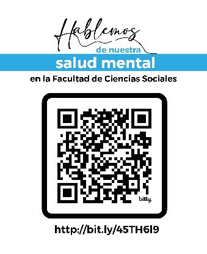

# GF-0657 Programación en SIG

**Profesor: Manuel Vargas Del Valle**

Grupo 001, horario L 17-18-19 y K 17-18-19 (17:00 a 19:50), aula 215, Créditos: 3

Requisitos: GF-0624 o GF-0412

Horas totales semanales: 6 horas (teoría 0, laboratorio 6, gira 0).

Horario de atención al estudiantado: K 14-15-16 (14:00 a 16:50).

Correo electrónico institucional: manuel.vargas_d@ucr.ac.cr

II ciclo lectivo 2026

## PROGRAMA DEL CURSO

### 1. DESCRIPCIÓN

Este curso trata sobre el manejo, la visualización y el análisis de datos geoespaciales mediante el lenguaje de programación Python. Se estudian los fundamentos de Python, sus bibliotecas geoespaciales y su empleo en el desarrollo de aplicaciones de sistemas de información geográfica (SIG), incluidas las destinadas a la Web. Se muestra cómo las metodologías y técnicas de ciencia de datos pueden aplicarse al componente geoespacial de diversos problemas. Además, se incorpora de manera paulatina y crítica el uso de herramientas de inteligencia artificial (IA) como apoyo en los procesos de programación y de análisis de datos.

El enfoque del curso es teórico-práctico, con lecciones teóricas combinadas con sesiones prácticas de programación en las cuales el estudiantado aplica, en diversos escenarios de procesamiento de datos, los conocimientos aprendidos y las habilidades desarrolladas. A lo largo del curso, cada estudiante desarrolla un tema de su elección mediante tareas que funcionan como aproximaciones incrementales al proyecto final.

El curso es presencial y el entorno virtual se emplea como apoyo a los aprendizajes. Los contenidos del curso y los recursos relacionados se comparten en el sitio web [https://gf0657-programacionsig.github.io/2026-ii/](https://gf0657-programacionsig.github.io/2026-ii/), así como en la plataforma Mediación Virtual de la Universidad de Costa Rica.

### 2. OBJETIVOS

Al finalizar el curso, el estudiantado será capaz de:

1. Desarrollar programas en el lenguaje de programación Python orientados al procesamiento de datos geoespaciales.
2. Aplicar un enfoque de ciencia de datos en los procesos de importación, transformación, visualización, análisis y comunicación de datos.
3. Desarrollar soluciones reproducibles a problemas computacionales mediante Python.
4. Integrar visualizaciones tabulares, gráficas y geoespaciales de datos en documentos computacionales y aplicaciones interactivas desarrolladas en Python.
5. Emplear de manera crítica, responsable y transparente herramientas de inteligencia artificial como apoyo en el desarrollo de programas y en el análisis de datos.

### 3. CONTENIDO DEL CURSO

| SEMANA | CONTENIDO | LECTURA OBLIGATORIA |
|---|---|---|
| **I. INTRODUCCIÓN A LA CIENCIA DE DATOS Y A LA PROGRAMACIÓN DE COMPUTADORAS** |  |  |
| 1 (10 al 14 de agosto) | Entrega y discusión del programa del curso.  Divulgación del Reglamento de la Universidad de Costa Rica en contra del Hostigamiento Sexual y promoción de un ambiente libre de discriminación.  Introducción a la ciencia de datos.  Cuadernos de notas Jupyter y Google Colab. | Mine Çetinkaya-Rundel & Johanna Hardin (2024, capítulo 1)  Google (s. f.)  Wes McKinney (2022, capítulo 2) |
| 2 (17 al 21 de agosto) | El editor de código Visual Studio Code.  El lenguaje de marcado Markdown.  Git, GitHub y GitHub Pages.  Introducción a la programación de computadoras.  Asistentes de programación basados en inteligencia artificial: panorama y lineamientos de uso en el curso. | Microsoft (s. f.-b)  *Markdown Tutorial* (s. f.)  Ihechikara Vincent Abba (2021)  GitHub (s. f.)  Allen B. Downey (2024, capítulo 1)  Charles Severance (2016, capítulo 1)  Stanford University (2025) |
| **II. EL LENGUAJE DE PROGRAMACIÓN PYTHON** |  |  |
| 3 (24 al 28 de agosto) | Instalación de Python mediante la plataforma Miniconda. Ambientes virtuales.  El lenguaje Python: • Historia y características. • Tipos de datos básicos. • Variables, expresiones y sentencias. • Condicionales.  **EXAMEN CORTO 1** | Anaconda (s. f.)  Microsoft (s. f.-a)  Charles Severance (2016, capítulos 1-3) |
| 4 (31 de agosto al 4 de setiembre) (Feriado: lunes 31 de agosto) | El lenguaje Python (continuación): • Funciones. • Iteración.  **ENTREGA DE TAREA 1** | Charles Severance (2016, capítulos 4 y 5) |
| 5 (7 al 11 de setiembre) | El lenguaje Python (continuación): • Hileras de caracteres. • Listas. • Diccionarios. • Tuplas. • Acceso a servicios web mediante interfaces de programación de aplicaciones (API) REST.  Uso de asistentes de inteligencia artificial para explicar y depurar código. | Charles Severance (2016, capítulos 6, 8-10, 12 y 13) |
| **III. ANÁLISIS Y VISUALIZACIÓN DE DATOS** |  |  |
| 6 (14 al 18 de setiembre) (Feriado: martes 15 de setiembre) | pandas: biblioteca para manipulación y análisis de datos.  **EXAMEN CORTO 2** | Kaggle (s. f.-b)  Wes McKinney (2022, capítulos 5 y 6) |
| 7 (21 al 25 de setiembre) | pandas (continuación).  matplotlib: biblioteca para visualización de datos.  Uso de asistentes de inteligencia artificial para generación y verificación de código de análisis de datos. | The Matplotlib Development Team (s. f.) |
| 8 (28 de setiembre al 2 de octubre) | plotly: biblioteca para graficación interactiva. | Plotly (s. f.) |
| **IV. PROCESAMIENTO DE DATOS GEOESPACIALES** |  |  |
| 9 (5 al 9 de octubre) | Introducción al manejo de datos geoespaciales: modelos de datos vectorial y raster, sistemas de referencia de coordenadas.  geopandas: biblioteca para manipulación y análisis de datos vectoriales.  **EXAMEN CORTO 3** | Kaggle (s. f.-a)  GeoPandas developers (s. f.) |
| 10 (12 al 16 de octubre) | geopandas (continuación).  **ENTREGA DE TAREA 2** | GeoPandas developers (s. f.) |
| 11 (19 al 23 de octubre) | rasterio: biblioteca para lectura, escritura y procesamiento de datos raster.  Ejemplos de análisis de datos vectoriales y raster. | Rasterio Contributors (s. f.) |
| 12 (26 al 30 de octubre) | folium: biblioteca para desarrollo de mapas web.  leafmap: biblioteca para análisis geoespacial y mapeo interactivo. | python-visualization (s. f.)  Qiusheng Wu (s. f.) |
| **V. DESARROLLO DE APLICACIONES INTERACTIVAS** |  |  |
| 13 (2 al 6 de noviembre) | streamlit: marco de trabajo para el desarrollo de aplicaciones web de ciencia de datos.  **EXAMEN CORTO 4** | Snowflake Inc. (s. f.)  Tyler Richards (2023, capítulos 1 y 2) |
| 14 (9 al 13 de noviembre) | streamlit (continuación): despliegue de aplicaciones en la Web.  **ENTREGA DE TAREA 3** | Snowflake Inc. (s. f.) |
| 15 (16 al 20 de noviembre) (Día del SIG: jueves 19 de noviembre) | Herramientas agénticas de inteligencia artificial para programación: revisión crítica del código generado y documentación de su uso.  Taller de desarrollo del proyecto final.  Participación en las jornadas del Día del SIG. | Stanford University (2025) |
| 16 (23 al 27 de noviembre) | Taller de cierre del proyecto final.  **EXAMEN CORTO 5**  **PRESENTACIÓN ORAL Y ENTREGA DE LA APLICACIÓN DEL PROYECTO FINAL** |  |
| SEMANA DE EXÁMENES (30 de noviembre al 4 de diciembre) | Entrega del documento computacional del proyecto final (examen final en modalidad para la casa). |  |

### 4. METODOLOGÍA

El curso se desarrolla mediante clases teórico-prácticas presenciales. Los conceptos teóricos son explicados por el profesor durante las sesiones de clase y también se abordan mediante lecturas previamente asignadas. Las sesiones prácticas se destinan a la realización de ejercicios de programación en los que el estudiantado aplica los conocimientos aprendidos y las habilidades desarrolladas, tanto en ejercicios cortos como en el desarrollo incremental del tema elegido para las tareas y el proyecto final.

Los recursos didácticos incluyen lecturas, documentación en línea, tutoriales, videos, conjuntos de datos de ejemplo y documentos computacionales (Jupyter Notebooks) con código ejecutable. Los contenidos de las lecciones están disponibles en el sitio web del curso ([https://gf0657-programacionsig.github.io/2026-ii/](https://gf0657-programacionsig.github.io/2026-ii/)), en el que hay enlaces a la bibliografía y a otros recursos de aprendizaje.

**Grado de virtualidad y uso del entorno virtual**: el curso es presencial y utiliza un entorno virtual en la plataforma Mediación Virtual como apoyo a los aprendizajes. En el entorno virtual se comparten el programa del curso, los enlaces a los contenidos de las lecciones y a los recursos didácticos; ahí también se realizan las entregas de las tareas y del proyecto final, se comunican las calificaciones mediante el libro de calificaciones y se envían mensajes oficiales. No se programan lecciones virtuales sincrónicas ni asincrónicas; en caso de fuerza mayor que impida una clase presencial, esta podría impartirse de manera virtual, previo visto bueno de la Dirección de la Escuela y comunicación oportuna al estudiantado.

**Uso de herramientas de inteligencia artificial**: el curso incorpora de manera paulatina el uso de asistentes de programación basados en IA (ej. asistentes conversacionales, asistentes integrados en editores de código y herramientas agénticas), como apoyo para explicar, depurar, generar y documentar código. Su uso se orienta con lineamientos de transparencia y pensamiento crítico: el estudiantado debe declarar el uso de estas herramientas en sus trabajos, comprender y ser capaz de explicar todo el código que entregue, y verificar los resultados generados.

La atención de dudas y consultas se realiza en clase, en el horario de atención al estudiantado (K 14-15-16), por medio del correo electrónico institucional y mediante el sistema de mensajes de Mediación Virtual.

### 5. EVALUACIÓN

La evaluación incluye tres componentes: exámenes cortos, tareas programadas y proyecto final.

**a. Exámenes cortos (25 %)**. Consisten en pruebas cortas individuales, realizadas presencialmente y sin asistencia de herramientas de inteligencia artificial. Su propósito es evaluar la comprensión de las lecturas y de los conceptos teóricos y prácticos cubiertos en clase. Las semanas estimadas de realización y las secciones del contenido del curso a evaluar en cada examen corto se presentan en la siguiente tabla:

| Semana de realización | Secciones a evaluar | Porcentaje de la calificación final del curso |
|---|---|---|
| 3 | I | 5 % |
| 6 | II | 5 % |
| 9 | III | 5 % |
| 13 | IV | 5 % |
| 16 | V | 5 % |

**b. Tareas programadas (40 %)**. Consisten en ejercicios de programación que deben ser resueltos fuera del tiempo de clase y que aplican los contenidos del curso al tema elegido por cada estudiante. Su propósito es que el estudiantado construya de manera incremental los productos que integrará en el proyecto final. Las semanas estimadas de entrega, los temas a desarrollar y el valor de cada tarea se presentan en la siguiente tabla:

| Semana de entrega | Tema a desarrollar | Porcentaje de la calificación final del curso |
|---|---|---|
| 4 | Elección del tema a desarrollar en las tareas y el proyecto final. Creación de un repositorio en GitHub y de una página web desarrollada en Markdown, con la descripción del tema y de sus fuentes de datos, publicada en Internet. | 10 % |
| 10 | Documento computacional (Jupyter Notebook) con datos del tema elegido, procesados mediante pandas y presentados en tablas y gráficos, publicado en Internet. | 15 % |
| 14 | Documento computacional (Jupyter Notebook) que incorpora datos geoespaciales del tema elegido, presentados en tablas, gráficos y mapas, publicado en Internet. | 15 % |

**c. Proyecto final (35 %)**. Su objetivo es sintetizar los conocimientos y habilidades aprendidos durante el curso. Consiste en el desarrollo del tema elegido en tres productos: (1) una aplicación web interactiva desarrollada en streamlit, o un marco de trabajo similar, con visualizaciones tabulares, gráficas y geoespaciales, publicada en Internet; (2) un documento computacional (Jupyter Notebook), con estructura de artículo, que documente el proceso de desarrollo, los datos y métodos utilizados y los principales hallazgos; y (3) una presentación oral presencial de la aplicación y de los resultados. La aplicación se entrega y se presenta oralmente en la semana 16, última semana de clases; el documento computacional se entrega en la semana de exámenes finales, como examen final en modalidad "para la casa". Los componentes y su valor se presentan en la siguiente tabla:

| Fecha de entrega o realización | Componente | Porcentaje de la calificación final del curso |
|---|---|---|
| Semana 16 | Aplicación web interactiva (streamlit o un marco de trabajo similar) con visualizaciones tabulares, gráficas y geoespaciales, publicada en Internet. | 20 % |
| Semana 16 | Presentación oral presencial del proyecto. | 5 % |
| Semana de exámenes | Documento computacional (Jupyter Notebook) con estructura de artículo, que documenta el proceso de desarrollo, los datos y métodos utilizados y los principales hallazgos, e incluye un breve informe de participación en las jornadas del Día del SIG (jueves 19 de noviembre). Se entrega como examen final en modalidad "para la casa". | 10 % |

En todas las evaluaciones, excepto los exámenes cortos, se permite el uso de herramientas de inteligencia artificial, siempre que este se declare explícitamente y que la persona estudiante comprenda y sea capaz de explicar el trabajo entregado. El uso no declarado de estas herramientas, o la incapacidad de explicar el trabajo propio, se considerará una falta a la honestidad académica, según lo establecido en el Reglamento de Orden y Disciplina de los Estudiantes de la Universidad de Costa Rica.

### 6. TRABAJO DE CAMPO

Este curso no incluye trabajo de campo.

### 7. NORMATIVA DE INTERÉS

Como primera instancia, el estudiantado puede acudir a: geografia@ucr.ac.cr; o bien, al director de Escuela: pascal.girotpignot@ucr.ac.cr.

El Reglamento de Régimen Disciplinario del Personal Académico establece mecanismos para resolver situaciones que afectan la excelencia en el ejercicio de la labor académica y en el desarrollo armonioso de los procesos institucionales.

El Reglamento de Orden y Disciplina de los Estudiantes de la UCR regula la disciplina del estudiantado en TODOS los recintos de la Institución y en aquellas acciones u omisiones que, aunque se produzcan fuera de las instalaciones que comprometan la buena marcha o el buen nombre de la Universidad de Costa Rica. Se establecen faltas, sanciones y procedimientos.

El Reglamento de Régimen Académico Estudiantil rige los procedimientos relacionados con la evaluación y orientación académica de las diversas categorías de estudiantes de la UCR. Incluye la orientación académica en cualquier época del año, las pruebas de reposición y pruebas opcionales, las necesidades educativas especiales, la igualdad y la equiparación de oportunidades, las funciones y deberes del profesor consejero, qué es un plan de estudios, la administración de los cursos, las normas de evaluación, las calificaciones e informes finales, el rendimiento académico del estudiantado, la orientación en matrícula, etc.

El Reglamento de la Universidad de Costa Rica en contra del Hostigamiento Sexual cubre a hombres y mujeres (docentes, administrativos y estudiantes). Esta norma está para proteger la dignidad de la persona en sus relaciones y garantiza un clima académico fundamentado en el respeto a la libertad, el trabajo, la igualdad, la equidad, el respeto mutuo y que conduzca al desarrollo intelectual, profesional y social, libre de cualquier forma de discriminación y violencia. Las denuncias se interponen ante la Comisión Institucional contra el Hostigamiento Sexual, que, con total confidencialidad, da seguimiento a los casos y consultas en esta materia.

El Reglamento del Servicio de Transportes que es aplicable a los miembros de la comunidad universitaria que, en sus labores o actividades académicas, usen o controlen los recursos de transporte de la Universidad de Costa Rica. También se cuenta con la Normativa para salidas de campo de la Escuela de Geografía.

En los cursos que se imparten en la Escuela de Geografía, se da especial importancia al desarrollo intelectual y académico de las personas estudiantes. Por ello, se reconoce y promueve la honestidad y la originalidad en la producción académica estudiantil. El incumplimiento de estas disposiciones podría dar lugar incluso, a que se emprendan procesos sancionatorios a quienes las incumplan, a partir de lo establecido en el Reglamento de orden y disciplina de los estudiantes de la Universidad de Costa Rica (artículo 4 y ss.)

Para casos de emergencias, comunicarse al teléfono: 2511-4911.

### 8. SOBRE LAS COMUNICACIONES OFICIALES ENTRE DOCENTES Y ESTUDIANTES

De acuerdo con la normativa universitaria, únicamente el correo oficial de la Universidad de Costa Rica, así como el sistema de mensajes de mediación virtual de la Universidad son los mecanismos oficiales de comunicación entre docentes y estudiantes. Por tanto, es obligación del estudiante contar con el correo de la Universidad, consultarlo al menos una vez al día durante días hábiles y utilizar los medios descritos para comunicarse con la persona docente. El uso de cualquier otro medio electrónico no será aceptado por la persona docente, quien no tendrá obligación alguna de responder a mensajes por otras vías no oficiales.

### 9. BIBLIOGRAFÍA

#### Bibliografía obligatoria

Abba, I. V. (2021). *Git and GitHub tutorial – Version control for beginners*. freeCodeCamp. https://www.freecodecamp.org/news/git-and-github-for-beginners/

Anaconda. (s. f.). *Getting started with conda*. Conda Documentation. Recuperado el 3 de agosto de 2026, de https://docs.conda.io/projects/conda/en/latest/user-guide/getting-started.html

Çetinkaya-Rundel, M., & Hardin, J. (2024). *Introduction to modern statistics* (2.ª ed.). OpenIntro. https://openintro-ims.netlify.app/

Downey, A. B. (2024). *Think Python: How to think like a computer scientist* (3.ª ed.). O'Reilly Media. https://greenteapress.com/wp/think-python-3rd-edition/

GeoPandas developers. (s. f.). *GeoPandas documentation*. Recuperado el 3 de agosto de 2026, de https://geopandas.org/

GitHub. (s. f.). *Quickstart for GitHub Pages*. GitHub Docs. Recuperado el 3 de agosto de 2026, de https://docs.github.com/en/pages/quickstart

Google. (s. f.). *Te damos la bienvenida a Colab* [cuaderno de notas]. Google Colab. Recuperado el 3 de agosto de 2026, de https://colab.research.google.com/

Kaggle. (s. f.-a). *Geospatial analysis*. Kaggle Learn. Recuperado el 3 de agosto de 2026, de https://www.kaggle.com/learn/geospatial-analysis

Kaggle. (s. f.-b). *Pandas*. Kaggle Learn. Recuperado el 3 de agosto de 2026, de https://www.kaggle.com/learn/pandas

Markdown Tutorial. (s. f.). Recuperado el 3 de agosto de 2026, de https://www.markdowntutorial.com/

The Matplotlib Development Team. (s. f.). *Matplotlib tutorials*. Recuperado el 3 de agosto de 2026, de https://matplotlib.org/stable/tutorials/

McKinney, W. (2022). *Python for data analysis: Data wrangling with pandas, NumPy, and Jupyter* (3.ª ed.). O'Reilly Media. https://wesmckinney.com/book/

Microsoft. (s. f.-a). *Getting started with Python in VS Code*. Recuperado el 3 de agosto de 2026, de https://code.visualstudio.com/docs/python/python-tutorial

Microsoft. (s. f.-b). *Getting started with Visual Studio Code*. Recuperado el 3 de agosto de 2026, de https://code.visualstudio.com/docs

Plotly. (s. f.). *Plotly open source graphing library for Python*. Recuperado el 3 de agosto de 2026, de https://plotly.com/python/

python-visualization. (s. f.). *Folium documentation*. Recuperado el 3 de agosto de 2026, de https://python-visualization.github.io/folium/

Rasterio Contributors. (s. f.). *Rasterio: Access to geospatial raster data*. Recuperado el 3 de agosto de 2026, de https://rasterio.readthedocs.io/

Richards, T. (2023). *Streamlit for data science: Create interactive data apps in Python* (2.ª ed.). Packt Publishing.

Severance, C. R. (2016). *Python for everybody: Exploring data in Python 3* (S. Blumenberg & E. Hauser, Eds.). CreateSpace Independent Publishing Platform. https://www.py4e.com/html3/

Snowflake Inc. (s. f.). *Streamlit documentation*. Recuperado el 3 de agosto de 2026, de https://docs.streamlit.io/

Stanford University. (2025). *CS146S: The modern software developer*. Recuperado el 3 de agosto de 2026, de https://themodernsoftware.dev/

Wu, Q. (s. f.). *Leafmap*. Recuperado el 3 de agosto de 2026, de https://leafmap.org/

#### Bibliografía complementaria

Wing, J. M. (2006). Computational thinking. *Communications of the ACM, 49*(3), 33-35. https://doi.org/10.1145/1118178.1118215
